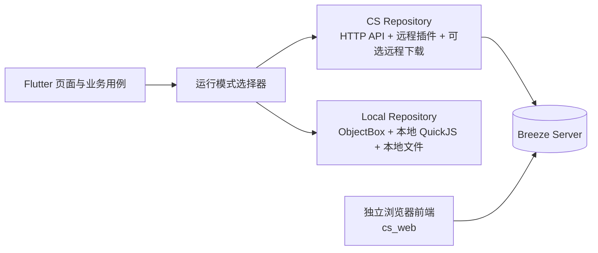

# Breeze CS 模式兼容架构设计

> 状态：CS 架构与第一版端到端实现。当前已落地 `cs_server`、单一 SQLite schema、用户会话、账号设置、收藏/历史/追更/文件夹/链接及收藏夹与下载夹辅助表 API、按用户隔离的 QuickJS 调用边界、用户级插件安装/更新/卸载/启用/调试配置、服务端插件元数据、插件配置、插件语义接口、可选服务端下载、Flutter 侧 CS Service/Repository 抽象、认证 WebSocket 宿主回调通道，以及独立的 React `cs_web` 前端。Flutter 原有纯本地模式仍保留。当前已实现“登录后可选迁移、重启后生效、关闭时可选远端覆盖本地”的模式切换流程：迁移和覆盖使用 JSON，插件 bundle 由服务端返回，已迁移下载文件和下载文件夹通过私有资产/SQLite 接口恢复；Web 前端继续暂缓完善。
>
> 目标：在保留现有纯本地模式的前提下，增加可选的 Client/Server（CS）模式。用户可以继续把 Breeze 当作现在的本地应用使用，也可以在设置中连接一个 Breeze 服务端，将指定能力切换到服务端。

## 1. 目标与非目标

### 1.1 目标

- 现有纯本地模式继续可用，默认行为、数据格式、插件能力和本地下载不因 CS 功能而改变。
- `cs_server` 从第一版就按多用户设计，保留最小账号认证和用户数据隔离；账号系统的主要目的，是避免任何人仅凭服务端 URL 匿名读取漫画数据。
- CS 模式下，业务数据的权威读写放到服务端；进入 CS 后，本地业务数据保留但冻结，不再被普通业务操作修改。
- CS 模式下，插件的安装、更新、删除、启用、配置、元数据和运行时全部由服务端管理；Flutter 不初始化或维护本地插件管理链路。
- 下载功能提供两种选择：
  - 客户端下载：服务端负责插件请求，下载任务和漫画文件仍保留在当前设备；这不允许客户端重新执行本地插件。
  - 服务端下载：服务端负责任务、插件、图片下载和存储，客户端只查看进度并阅读远程文件。
- 开启 CS 并登录后，先询问是否迁移本地业务数据；选择迁移后，再单独询问是否迁移下载任务和已下载漫画文件。
- 关闭 CS 模式时，询问是否使用远端数据覆盖本地数据；选择覆盖才执行回写，否则保留本地原有数据。
- 模式切换只保存待生效状态并提示重启，重启后由 `AppBootstrap` 根据目标模式初始化对应运行时。
- 不把 WebDAV/S3 文件同步直接当成 CS 模式。它们仍然是本地模式下的数据同步/备份能力；CS 模式应有明确的服务端 API 和服务端数据模型。

### 1.2 非目标

- 不把所有 Flutter 页面重写成另一套页面。
- 不让客户端直接连接 SQLite 或其他服务端存储。
- 不把 ObjectBox 的 Box、Query、事务等实现细节暴露成网络协议。
- 不把 `cs_server` 做成完善的公共漫画网站，不提供面向漫画站点的复杂角色、权限、配额、审核和运营后台。
- 不为插件增加独立的权限控制、版本选择、版本历史或版本回滚能力；插件如何使用由部署者和用户自行负责。
- 不强制所有用户把下载任务和下载文件迁移到服务端；未迁移下载时，CS 模式仍可使用“服务端插件 + 客户端文件”的下载模式。

## 2. 当前项目扫描结论

当前仓库没有服务端目录，现有实现基本是“Flutter 本地数据库 + 本地 QuickJS + 本地文件系统”。CS 模式需要在现有业务层前增加一层可替换的领域接口。

本方案新增以下工程边界：

```text
Breeze/
├─ cs_server/                         # 新的独立 Rust 服务端工程
│  ├─ Cargo.toml
│  ├─ Cargo.lock
│  └─ src/
│     ├─ main.rs
│     ├─ api/
│     ├─ app_state.rs
│     ├─ config/
│     ├─ db/
│     ├─ domain/
│     ├─ plugin/
│     ├─ download/
│     └─ storage/
├─ cs_web/                            # 独立浏览器前端工程，不是 Flutter Web
│  ├─ package.json                    # pnpm 脚本和 packageManager 版本
│  ├─ pnpm-lock.yaml
│  ├─ eslint.config.*                 # ESLint 配置
│  ├─ .prettierrc.*                   # Prettier 配置
│  ├─ src/
│  └─ dist/                           # 构建后的静态资源，可由 cs_server 直接提供
├─ rust/rquickjs_playground/          # 复用的 QuickJS/Web Runtime 基础库
└─ rust/                              # 现有 Flutter Rust FFI，不作为服务端入口
```

`cs_server` 是放在 Breeze 项目根目录下的独立 Cargo package，不要求把整个 Flutter 工程改成 Cargo workspace。服务端通过 path dependency 直接依赖 `rust/rquickjs_playground`，保留单独的 `Cargo.lock` 和服务端构建入口。

`cs_web` 是独立的 HTML/CSS/JavaScript 前端工程，不能把当前 Flutter 项目编译成 Flutter Web 来替代它。浏览器前端和 Flutter 客户端都只消费同一套版本化服务端 API。当前第一版已经覆盖登录、总览、漫画搜索、详情、阅读器、书架、下载任务和连接设置，并由 `cs_server` 直接托管静态资源。

本方案为 `cs_web` 选择以下技术栈：

- React + TypeScript：适合拆分阅读器、漫画详情、章节列表、书架等交互组件；
- Vite：负责开发服务器、构建和静态资源输出；
- React Router：支持漫画详情、阅读器和章节等浏览器路由；
- pnpm：唯一的前端包管理器，提交 `pnpm-lock.yaml`，不使用 npm 或 yarn 维护依赖。

这只是独立浏览器前端的实现选择，不会影响 Flutter 客户端和 Rust 服务端的技术栈。

### `cs_web` 状态管理与 UI 组件

从长期可维护性、多人协作和 CS 场景的服务端数据特征考虑，状态管理采用：

- **Redux Toolkit**：管理跨页面的客户端状态，例如登录会话、CS/本地运行模式、阅读器设置、下载任务展示状态和筛选条件。使用现代 Redux 写法，不直接采用传统 Redux 的手写 action/reducer 模式；
- **RTK Query**：管理服务端状态，例如漫画列表、插件调用结果、收藏、历史、追更、分页、缓存、请求去重和失效刷新。服务端数据不应全部手动复制到普通 Redux slice 中；
- React 组件自身的 `useState`：只承载弹窗开关、输入框内容等短生命周期的局部 UI 状态。

因此，推荐的组合为 `@reduxjs/toolkit`（包含 RTK Query）+ React Router，而不是额外引入多个互相重叠的状态管理方案。参考：[Redux Toolkit 官方文档](https://redux.js.org/redux-toolkit/overview/)。

UI 组件采用 **shadcn/ui + Radix UI + Tailwind CSS**：

- shadcn/ui 不是封装后只能通过 npm API 使用的黑盒组件库，而是将组件源码加入 `cs_web`，由项目自己持有和修改；
- Radix UI 提供可访问性和交互基础，减少自行实现 Dialog、Popover、Dropdown、Tooltip 等基础行为的风险；
- Tailwind CSS 负责样式、响应式布局和设计 token，方便形成 Breeze 自己的视觉规范；
- 该组合适合阅读器、书架、漫画卡片和图片浏览等需要高度定制的界面，也能降低未来被第三方组件库主题绑定的风险。

组件目录建议按以下边界组织：

```text
cs_web/src/
├─ components/
│  ├─ ui/          # shadcn/ui 基础组件，只负责通用交互和样式
│  ├─ breeze/      # Breeze 通用业务组件
│  └─ reader/      # 阅读器专用组件
├─ features/      # 按业务领域组织页面、slice 和用例
├─ services/      # RTK Query API、认证和服务端请求定义
└─ app/            # Redux store、路由和应用级初始化
```

`components/ui` 中的组件源码由本项目负责维护；引入新组件时优先通过 shadcn/ui 添加，再按 Breeze 的设计 token 和交互要求调整。业务代码不应直接在各处修改基础组件的内部实现，而应在 `components/breeze` 或 `components/reader` 中进行组合和封装。

如果未来更看重开箱即用和完整后台控件，也可以评估 MUI；但 MUI 的 Material Design 风格和组件主题约束更明显，本项目暂不将其作为默认方案。参考：[shadcn/ui 官方文档](https://ui.shadcn.com/docs) 和 [MUI 官方文档](https://mui.com/material-ui/)。

### `cs_web` 前端工程规范

`cs_web` 初始化时必须配置：

- ESLint：检查 TypeScript、React、React Hooks 和基础代码质量；
- Prettier：统一 TypeScript、TSX、CSS、JSON、Markdown 等文件格式；
- `package.json` 中的 `packageManager` 字段固定 pnpm 主版本；
- `pnpm-lock.yaml` 必须提交到仓库；
- 至少提供 `dev`、`build`、`preview`、`lint`、`format` 和 `format:check` 脚本。

建议脚本语义如下：

| 脚本 | 作用 |
| --- | --- |
| `pnpm dev` | 启动浏览器前端开发服务器 |
| `pnpm build` | 生成可由 `cs_server` 提供的 `dist/` |
| `pnpm preview` | 预览生产构建结果 |
| `pnpm lint` | 执行 ESLint，发现错误时失败 |
| `pnpm format` | 使用 Prettier 写回格式化结果 |
| `pnpm format:check` | 只检查格式，不修改文件 |

前端每次完成代码修改后，必须至少执行一次 `pnpm format` 和一次 `pnpm lint`。推荐固定顺序为：

1. `pnpm format`；
2. `pnpm lint`；
3. 提交或交付前再执行 `pnpm format:check` 和 `pnpm build`。

如果 Prettier 修改了文件，必须重新执行 `pnpm lint`，不能把格式化前的 lint 结果当作最终结果。后续如增加测试，再把 `pnpm test` 加入同一套交付检查。

### 2.1 数据库

ObjectBox 在 `lib/object_box/object_box.dart` 中集中初始化，但业务代码仍然广泛直接访问 `objectbox.*Box`。主要实体包括：

| 领域 | 当前实体/数据 | CS 处理方向 |
| --- | --- | --- |
| 统一收藏 | `UnifiedComicFavorite` | 服务端权威 |
| 阅读历史 | `UnifiedComicHistory` | 服务端权威 |
| 追更 | `ComicFollow` | 服务端权威 |
| 收藏夹 | `FavoriteFolder`、`FavoriteFolderItem`、`ComicFolder`、`ComicLink` | 服务端权威 |
| 插件 | `PluginInfo`、`PluginConfig` | 服务端权威；配置按用户隔离 |
| 用户设置 | `UserSetting`、`GlobalSettingState` | 拆分为账号设置和设备设置 |
| 下载任务 | `DownloadTask` | 根据下载模式决定归属 |
| 已下载漫画 | `UnifiedComicDownload`、`DownloadFolder`、`DownloadFolderItem` | 根据下载模式决定归属 |
| 旧版数据 | `Bika*`、`Jm*` | 只作为本地迁移/导入来源，不建议新增服务端旧表 |

当前 `UserSetting` 同时包含全局设置、图源设置、窗口尺寸、缓存设置、应用锁和本地路径等内容，不能整体无差别上传。CS 设计必须对设置进行“账号级”和“设备级”拆分。

当前实现的数据库边界如下：

- CS 启动时通过 `CsRemoteDatabase` 从服务端加载收藏、历史、追更、文件夹、链接、收藏夹及其成员、下载夹及其成员，旧的同步业务服务和原有书架 BLoC 在 CS 下只操作这份内存镜像并写回服务端 SQLite；不会另起一套书架页面，也不会把这些数据写入本地 ObjectBox。
- CS 模式复用 Flutter 原有的 `BookshelfPage`、收藏/历史/下载三个标签、分页、文件夹、选择和批量操作；CS 只替换书架数据来源。未开启服务端下载时，下载标签、下载夹、本地任务、已下载漫画和文件路径仍保持原本的客户端本地行为，不得隐藏下载入口。
- `GlobalSettingCubit` 在 CS 下从 `user_settings` 加载账号级设置，普通设置更新写回服务端；代理、缓存、应用锁、窗口和本地路径等设备设置仍只保留在本地。
- `DownloadTask`、`UnifiedComicDownload` 及下载文件只有在选择“客户端下载”时才允许继续写本地；选择“服务端下载”时使用服务端任务、manifest 和资产接口。这个下载例外不能扩大到插件管理或其他业务数据。
- 旧版 `Bika*`/`Jm*` 实体、数据备份和本地 WebDAV/S3 同步属于本地维护/迁移工具，不作为 CS 运行时数据库表。

### 2.2 插件

插件运行链路主要位于：

- `lib/network/http/plugin/unified_comic_plugin.dart`
- `lib/network/http/plugin/qjs_download_runtime.dart`
- `lib/plugin/plugin_registry_service.dart`
- `rust/src/api/qjs.rs`
- `rust/src/qjs/`
- `rust/rquickjs_playground/`

当前插件调用至少覆盖以下能力：

- `getInfo`
- `init`
- `searchComic`
- `getComicDetail`
- `getChapter`
- `getReadSnapshot`
- `fetchImageBytes`
- `getSettingsBundle`
- 插件配置的 `load_plugin_config` / `save_plugin_config`

因此，CS 模式不能只把“搜索接口”转发到服务端，而应迁移完整的插件运行时、插件配置、登录状态、图片获取和取消机制。

### 2.3 下载

当前下载逻辑主要位于：

- `lib/service/download/download_queue_manager.dart`
- `lib/service/download/comic_download_task.dart`
- `lib/service/download/image_download.dart`
- `lib/network/http/picture/picture.dart`

现有流程是：ObjectBox 保存 `DownloadTask`，Dart 侧调度队列，插件获取漫画详情和章节，Dart/QuickJS 获取图片字节，最后写入本地缓存或下载目录，并把下载结果写入 `UnifiedComicDownload`。

这意味着“服务端下载”不是简单把任务表搬到远端，还需要迁移：

- 任务调度、重试、取消和崩溃恢复；
- 插件执行和带登录态的图片请求；
- 图片文件存储和路径映射；
- 下载结果 manifest；
- 客户端阅读远程图片的鉴权和断点读取。

当前服务端下载实现已经补齐：插件调用最多对可重试的网络错误尝试三次，取消会同时通知插件 runtime 和下载 Worker；任务失败或取消时会删除已写入的临时文件及对应 `assets` 记录，manifest 成功保存后才保留已完成资产。插件 runtime 采用按用户/插件隔离的空闲回收策略，空闲超过 30 分钟由后台 reaper 丢弃，进程内缓存仍保持原有设计。

### 2.4 现有 WebDAV/S3 同步

当前 `lib/network/sync/` 已经实现收藏、历史、文件夹、设置和插件配置的文件级同步，但它是“多个本地数据库之间合并文件”，不是服务端应用架构。CS 模式下：

- 本地模式可以继续使用 WebDAV/S3；
- CS 模式不应同时对同一批数据运行旧的自动同步；
- 服务端成为权威后，冲突合并应由服务端版本号/事务处理完成；
- 原有同步数据可作为首次迁移或导入来源。

## 3. 总体设计原则

### 3.1 两种运行模式并存



页面和业务用例只依赖领域接口，不直接判断“当前是不是 CS”。模式差异放在 Repository、PluginGateway、DownloadGateway 等基础设施实现中。

### 3.2 服务端是 CS 业务数据的唯一权威

CS 模式下，客户端可以保留 ObjectBox 作为缓存、离线草稿和本机必要配置，但它不能继续作为业务数据的独立权威来源。

- 读：优先从服务端获取，允许使用带版本号的本地缓存。
- 写：先提交服务端，服务端成功后再更新本地缓存。
- 网络失败：明确显示离线状态；允许排队的操作必须有 Outbox 和重试策略，不能静默写入另一份本地数据。
- 禁止在 UI 中出现大量 `if (csMode) ... else ...`。

### 3.3 用稳定业务 ID，不依赖 ObjectBox 自增 ID

服务端不能使用客户端的 ObjectBox `id` 作为跨设备身份。建议：

- 漫画使用 `source + comicId` 或现有 `uniqueKey`；
- 文件夹继续使用 `ComicFolder.syncId`；
- 文件夹链接继续使用稳定的 `ComicLink.uniqueKey`；
- 任务、会话、插件安装记录使用 UUID；
- ObjectBox 的整数 `id` 只保留在本地缓存层。

### 3.4 先定义领域 API，再决定 REST 或其他传输方式

推荐第一版使用版本化 HTTP JSON API，原因是当前 Flutter 已经有 `WindHttp`，调试和自托管都比较直接。实时进度使用 WebSocket 或 SSE，不能用高频轮询替代所有状态推送。

## 4. 运行模式与能力矩阵

建议在连接配置中明确保存以下信息：

- `activeMode`: 当前已经生效的 `local` / `cs`；只在应用重启后的 `AppBootstrap` 阶段读取并决定初始化路径；
- `pendingMode`: 用户选择但尚未重启生效的 `local` / `cs`；
- `serverUrl`
- `accountId` 或服务端用户身份
- 客户端会话令牌
- `downloadMode`: `client` / `server`
- 最近一次迁移状态、迁移范围和服务端数据版本

| 能力 | 纯本地模式 | CS + 客户端下载 | CS + 服务端下载 |
| --- | --- | --- | --- |
| 收藏/历史/追更 | 本地 ObjectBox | 服务端；迁移前后按用户选择 | 服务端；迁移前后按用户选择 |
| 文件夹和链接 | 本地 ObjectBox | 服务端；未迁移前保持本地快照 | 服务端；未迁移前保持本地快照 |
| 插件管理和插件代码执行 | 本地 Registry + QuickJS | 服务端 | 服务端 |
| 插件配置/登录态 | 本地 | 服务端按用户保存 | 服务端按用户保存 |
| 搜索、详情、章节、阅读接口 | 本地插件 | 服务端插件 API | 服务端插件 API |
| 阅读图片 | 本地插件/网络 | 服务端代理或短期资源令牌 | 服务端资源存储 |
| 下载任务 | 本地队列 | 本地队列，插件请求走服务端 | 服务端队列 |
| 下载漫画文件 | 本机文件系统 | 本机文件系统 | 服务端文件存储 |
| 应用缓存、窗口位置、本地路径 | 本地 | 本地 | 本地 |
| WebDAV/S3 旧同步 | 可用 | 默认关闭 | 默认关闭 |

下载模式是 CS 模式中的独立迁移选择：进入 CS 时询问是否把下载任务和既有文件迁移到服务端；不迁移时继续使用客户端本地下载，但下载所依赖的插件仍由服务端执行。模式切换不会删除任何一侧的原始数据。

## 5. 服务端建议组成

服务端工程固定使用根目录下的 `cs_server/`，不建议把服务端数据库访问代码塞进 Flutter 工程，也不建议让服务端依赖现有 `windcore` Flutter FFI crate。建议拆成以下模块：

1. **API 层**：认证、权限、请求校验、版本协商、错误映射。
2. **Domain/Application 层**：收藏、历史、文件夹、追更、插件、下载等用例。
3. **Repository 层**：SQLite、服务端文件存储、插件包存储、任务队列。
4. **Plugin Runtime 层**：基于 `rust/rquickjs_playground` 的 QuickJS 沙箱、插件包加载、用户配置、网络请求、取消和资源限制。
5. **Download Worker 层**：服务端默认提供；客户端选择服务端下载时提交任务并由该 Worker 执行，选择本地下载时不提交服务端任务。
6. **Web Delivery 层**：可选地直接提供独立前端的 HTML、CSS、JavaScript、图片和其他静态资源，不依赖 Nginx。
7. **Event 层**：将数据变更和下载进度推送给客户端。

### 5.1 Rust 工程和 QuickJS 复用边界

`cs_server` 直接复用 `rust/rquickjs_playground` 的公开能力，重点包括：

- `AsyncHostRuntimeBuilder`、`AsyncHostRuntime` 和任务句柄；
- `WebRuntimeOptions`，服务端插件 runtime 默认使用 `fs: false`；
- QuickJS 的 `fetch`、Abort、Headers、URL、Buffer、crypto 和 native buffer 能力；
- `configure_http_client`、`current_http_client_config` 和 `build_http_client`；
- 现有的 HTTP 取消、并发控制、全局 tokio runtime 和插件 bundle 装载机制。

服务端不直接依赖现有 `windcore`，原因是 `windcore` 的定位是 Flutter Rust Bridge 的 `cdylib/staticlib`，包含移动端目标、FFI 生成代码和应用侧初始化。服务端只需要依赖 QuickJS/Web Runtime，不应把 Flutter 平台耦合带进来。

服务端第一版可以使用 Axum + Tokio；`rquickjs_playground` 已经使用相同的异步生态，服务端只负责组合 API、数据库和任务队列。

### 5.2 独立浏览器前端预留

服务端从第一天就应当把“API 服务”和“HTML/静态资源服务”设计成两个可以独立开关的能力，但它们可以运行在同一个 Rust 进程中：

- `/api/v1/*`：只返回版本化 JSON、事件流和明确的 HTTP 错误码；
- `/media/*`：提供经过权限校验的漫画图片、封面和下载资源；
- `/`、`/app/*` 或 `/reader/*`：可选地返回独立前端的 HTML 和静态资源；
- `web_root`：在 `cs_server/config.yaml` 中配置 `../cs_web/dist` 或其他静态文件目录；
- 未命中具体静态文件时，可以将浏览器路由回退到 `index.html`，支持前端路由；
- 未配置前端资源时，服务端仍然只启动 API，不因为缺少 `cs_web` 而无法运行。

实现上可以使用 Axum/Tower 的静态文件服务，在服务端进程内直接读取 HTML 和资源文件。生产部署可以选择 Nginx、Caddy 或其他反向代理，但它们是可选的，不能成为服务端提供浏览器功能的前置条件。

独立浏览器前端需要的接口必须从一开始就避免 Flutter 专属假设：请求和响应使用标准 JSON、分页、HTTP 状态码、`ETag`/`Last-Modified` 和可选的 `Range`；图片资源支持浏览器直接加载、缓存和断点读取。Flutter 客户端可以继续使用 Bearer token，浏览器前端则应支持 HttpOnly/Secure/SameSite Cookie，并为写操作预留 CSRF 校验。

开发环境允许 `cs_web` 使用独立端口，因此 API 需要提供可配置 CORS；生产环境推荐让服务端直接提供静态文件，使前端和 API 同源，默认关闭跨域开放策略。

`cs_web` 不参与当前 Flutter 的构建、路由生成或 Dart 代码生成。未来浏览器阅读器只需要调用搜索、详情、章节、阅读快照、图片资源、收藏/历史和下载任务 API，不应访问 SQLite、插件 runtime 或服务端文件路径。

### 5.3 SQLite 嵌入方式

服务端数据库固定使用 SQLite，不使用 PostgreSQL、MySQL、外部数据库服务或纯 Rust 重实现。建议采用：

- `rusqlite` 作为 Rust 业务层封装；
- 开启 `rusqlite` 的 `bundled` feature，使 `libsqlite3-sys` 编译并静态链接官方 SQLite C amalgamation；
- 数据库文件默认放在服务端数据目录，例如 `data/breeze.sqlite3`；
- 服务端启动时开启外键约束、WAL、合理的 busy timeout，并一次性创建当前完整 schema；
- 当前阶段不做 SQLite schema 版本兼容和在线迁移，schema 变化时删除服务端旧 `breeze.sqlite3` 后重新建库；
- 所有 SQL 只出现在 `cs_server/src/db/` 的 Repository/Schema 层，API、插件和下载模块不直接操作连接。

这里的 `bundled` 方案仍然是官方 SQLite 的 C 实现，只是由 Cargo 在构建时嵌入服务端二进制。如果后续确实需要直接调用 C API，可以在同一层替换为 `libsqlite3-sys`，但不能让业务模块散落裸 FFI 调用。

服务端下载的图片不建议作为 SQLite BLOB 保存。SQLite 保存下载任务、manifest、文件 hash、大小和服务端相对存储 key；图片文件先放在服务端配置的数据目录中，后续再增加对象存储适配器。

### 5.4 多用户插件包存储与更新边界

插件包本体不放进 SQLite BLOB。SQLite 保存当前插件的身份、展示信息、当前版本字符串、hash、压缩信息和存储 key，插件包放在服务端配置的数据目录中。插件包可以使用 Brotli 压缩，并以 hash 作为内容身份，用于压缩、去重和完整性校验。

这里的版本字符串只是插件自身的元数据和更新比较依据，不代表服务端提供版本控制能力。本项目刻意不实现：

- `plugin_versions` 或用户可选择的历史版本列表；
- 插件版本历史、版本回滚和旧版本恢复；
- 用户级插件版本锁定；
- 更新完成后的撤销操作。

插件更新采用“当前版本直接替换”的模型：下载到临时位置，校验插件 UUID、`getInfo`、hash 和包体完整性后原子替换当前 bundle。更新失败时不能留下半包，但更新成功后不提供回滚入口。用户手动找到低版本插件并强行安装时不拦截，该低版本会直接成为当前版本。

插件自动更新不可关闭，这是产品设计而不是遗漏。服务端参考本体 `PluginCloudUpdateService` 的现有逻辑，实现云端目录更新和插件自身更新通道；更新由服务端执行，客户端只展示结果，不提供关闭自动更新的设置。服务端启动后检查一次，之后每四小时检查一次。

插件配置、登录态、Cookie、token、启用状态和调试状态仍然按用户保存，不能写进公共插件包。相同 hash 的当前 bundle 可以被多个用户复用，但不能因此共享用户配置或运行时状态。即使插件包较小，也统一放在文件存储中，避免 SQLite 因 BLOB 更新、WAL 和备份持续膨胀。

插件自动更新任务的固定策略如下：服务端启动后执行一次检查，之后每四小时检查一次插件目录和插件自身更新通道。检查和更新由服务端后台任务完成，不依赖 Flutter 或 Web 客户端在线，也不提供关闭自动更新的设置。每次更新仍然遵守“下载、校验、原子替换当前 bundle”的规则。

服务端自身的自动更新是另一项独立能力，优先级暂时较低。它未来负责检查并替换 `cs_server` 自身的可执行文件或发行包，必要时重启服务；不能与插件自动更新混为一谈，也不能阻塞插件自动更新的实现。服务端自身自动更新的检查周期、发布源、替换方式和失败恢复策略后续单独确定。

### 5.5 全局 reqwest 配置

服务端所有主动发出的 HTTP 请求统一使用 Rust 侧全局 HTTP 配置，不在插件、下载任务或单个 API handler 中各自创建一套代理/TLS 配置。

启动流程建议为：

1. 读取 `cs_server/config.yaml`（也支持通过 `--config <path>` 指定配置文件）；
2. 生成 `rquickjs_playground::HttpClientConfig`；
3. 通过 `rquickjs_playground::configure_http_client` 设置全局配置；
4. 使用 `current_http_client_config` + `build_http_client` 构建服务端共享的 `reqwest::Client`；
5. 将共享客户端放进 Axum `AppState`，插件 runtime 的 JS `fetch` 继续使用 playground 内部同一套全局配置。

全局配置至少覆盖 HTTP/SOCKS5 代理、TLS 校验、内网访问策略、连接超时、请求超时、重定向和 User-Agent。服务端路由、插件请求和下载 Worker 必须复用这套配置；不允许通过插件参数覆盖代理或关闭 TLS 校验。

CS 服务端默认开启 TLS 校验。即使现有 Flutter 应用为了兼容图源而可能关闭 TLS 校验，也不能把这个不安全默认值自动带入服务端；是否允许关闭必须是服务端管理员明确配置，并记录启动告警。

建议的服务端存储：

- SQLite：用户、插件元数据、业务记录、任务状态、版本号和资源 manifest；
- 服务端数据目录：下载图片、插件包、可选的导入备份；
- 队列：下载任务、插件更新、追更检查等耗时任务；
- 后续可以把服务端数据目录替换为对象存储，但不能改变上层 manifest 和资源权限模型。

## 6. 数据层设计

### 6.1 服务端领域表

第一版建议至少有以下逻辑表，具体表名可以调整：

| 逻辑表 | 主要字段 | 说明 |
| --- | --- | --- |
| `users` | `id`、认证字段、状态、创建时间 | 用户/账号；用于最小认证和用户数据隔离 |
| `user_settings` | `user_id`、账号级设置 JSON、版本号 | 不放本地路径、窗口位置、应用锁 |
| `comic_favorites` | `user_id`、`unique_key`、来源字段、展示字段、`updated_at`、`deleted_at` | 对应统一收藏 |
| `comic_histories` | `user_id`、`unique_key`、章节、页码、时间、版本号 | 对应阅读历史 |
| `comic_follows` | `user_id`、漫画字段、检测状态、时间 | 对应追更 |
| `comic_folders` | `user_id`、`sync_id`、父 ID、名称、类型、删除标记、版本号 | 保留现有稳定 folder ID |
| `comic_links` | `user_id`、漫画 key、folder ID、类型、删除标记、版本号 | 保留文件夹链接语义 |
| `favorite_folders`、`favorite_folder_items` | `user_id`、收藏夹 key、收藏记录 key、删除标记 | 收藏夹及成员关系 |
| `download_folders`、`download_folder_items` | `user_id`、下载夹 key、下载记录 key、删除标记 | 服务端下载模式使用 |
| `plugins` | 插件 UUID、名称、描述 | 全局插件身份，不绑定单个用户 |
| `plugin_objects` | 内容 hash、压缩算法、原始/压缩大小、storage key、状态、创建时间 | 当前 bundle 的共享压缩对象；hash 用于去重和完整性校验，不用于版本历史 |
| `user_plugins` | `user_id`、插件 UUID、启用状态、调试状态、更新时间 | 用户插件关联状态，不保存版本选择，不复制插件包 |
| `plugin_configs` | `user_id`、插件 UUID、配置 JSON、版本号 | 普通插件配置；服务端 SQLite 中按用户和插件隔离 |
| `download_tasks` | `user_id`、任务 UUID、状态、进度、错误、取消版本 | 服务端下载模式使用 |
| `download_manifests` | `user_id`、漫画 key、章节/图片 manifest、文件存储 key | 服务端下载模式使用 |
| `assets` | 所属用户、文件存储 key、大小、hash、媒体类型 | 下载图片和封面索引 |

`detailJson`、`chapters`、`metadata` 等现有动态字段第一阶段可以放在 SQLite 的 TEXT JSON 中，同时把查询需要的 `source`、`comic_id`、标题、时间、删除标记等字段单独列出。后续只有在查询性能确实不足时再拆成更多规范化表。

### 6.2 设置拆分

建议把现有 `UserSetting` 拆成两类：

**账号级，可同步到服务端：**

- 语言和主题偏好；
- 阅读模式、阅读器行为偏好；
- 书架排序和展示偏好；
- 需要跨设备生效的普通应用偏好；
- 插件启用状态和插件配置。

**设备级，只保留本地：**

- 窗口宽高、窗口坐标；
- `customExportPath`、缓存目录、下载根目录；
- 应用锁密码哈希及本机安全凭据；
- 设备代理、日志转发地址等本机网络设置；
- 缓存大小、图片缓存和本地超分模型状态。

这样既能满足“业务数据库操作服务端化”，又不会把本机路径和安全凭据错误地放到服务端。

### 6.3 事务与版本

服务端的每次写操作应具备：

- `request_id` 或幂等键，避免客户端重试导致重复创建；
- `expected_version` 或 `If-Match`，防止覆盖其他设备刚写入的数据；
- 服务端递增的 `revision`，用于客户端缓存失效和增量同步；
- 软删除记录保留足够时间，避免其他客户端把删除数据重新上传。

现有文件夹版本向量可以保留在兼容字段中。CS 模式只有一个服务端权威写入点时，日常冲突主要由服务端事务和 revision 解决；从旧本地数据导入时仍可使用现有版本向量做一次合并。

### 6.4 多用户隔离边界

多用户不是在单用户版本完成后再补上的能力。所有账号级数据表、下载任务、服务端资产、插件配置和插件会话都必须带 `user_id`，服务端从认证会话推导用户身份，不信任客户端直接传入的 `user_id`。这里的用户隔离只用于防止用户之间互相读取数据，不延伸为漫画网站级的角色、配额、审核或插件权限系统。

插件包对象可以被多个用户共享；插件配置、Cookie、token、下载文件和运行时会话不属于共享资源，必须按用户隔离。删除用户关联不能影响其他用户正在使用的当前 bundle。所有插件调用都绑定 `user_id + plugin_id + runtime/session`，不能因为插件包相同而共享用户状态。服务端的管理员 token 和安装开关属于部署运维保护，不是面向用户的插件权限模型。

## 7. API 设计草案

不要提供类似“远程 Box CRUD”的接口，应该提供面向业务的接口。

### 7.1 基础接口

| 领域 | 示例接口 | 说明 |
| --- | --- | --- |
| 健康检查 | `GET /api/v1/health` | 客户端连接测试和版本信息 |
| 会话 | `POST /api/v1/auth/login`、`POST /api/v1/auth/refresh` | 会话令牌和过期策略 |
| 能力 | `GET /api/v1/capabilities` | 服务端是否支持服务端下载、实时事件、插件上传等 |
| 数据版本 | `GET /api/v1/revision` | 客户端判断缓存是否过期 |
| 导入导出 | `POST /api/v1/migrations/import`、`GET /api/v1/migrations/export` | 初次 JSON 迁移和关闭 CS 时的可选本地覆盖 |

### 7.2 业务数据接口

建议按领域提供：

- `GET/POST/PATCH/DELETE /api/v1/library/favorites`
- `GET/POST/PATCH/DELETE /api/v1/library/history`
- `GET/POST/PATCH/DELETE /api/v1/library/follows`
- `GET/POST/PATCH/DELETE /api/v1/library/folders`
- `GET/POST/PATCH/DELETE /api/v1/library/links`
- `GET/PATCH /api/v1/settings/account`
- `GET/PATCH /api/v1/plugins/{pluginId}/config`

文件夹移动、批量删除、移动漫画等操作最好提供一个原子业务接口，而不是让客户端连续发多个底层更新请求。这样可以保留现有 `ComicFolderService` 和 `ComicLinkService` 的业务语义。

### 7.3 插件接口

插件管理和插件调用都必须以当前 Bearer 用户为边界。客户端在 CS 模式下只展示服务端返回的数据，不直接操作本地插件 Registry 或本地 QuickJS runtime。

插件管理接口：

- `GET /api/v1/plugins`
- `GET/PATCH/DELETE /api/v1/plugins/{pluginId}`
- `GET/PATCH /api/v1/plugins/{pluginId}/config`
- `GET /api/v1/plugins/catalog`
- `POST /api/v1/plugins/catalog/install`
- `POST /api/v1/plugins/install-url`
- `POST /api/v1/plugins/install-bundle`

推荐提供统一调用入口，同时为常用能力保留语义明确的别名：

- `POST /api/v1/plugins/{pluginId}/invoke`
- `POST /api/v1/plugins/{pluginId}/search`
- `POST /api/v1/plugins/{pluginId}/comic/{comicId}/detail`
- `POST /api/v1/plugins/{pluginId}/comic/{comicId}/chapter`
- `POST /api/v1/plugins/{pluginId}/comic/{comicId}/read`
- `GET /api/v1/plugins/{pluginId}/assets/{assetToken}`
- `GET /api/v1/ws?access_token={token}`：认证后的插件宿主回调 WebSocket

统一调用请求至少应包含：

- 插件 UUID 和服务端插件版本；
- 逻辑函数名/函数路径；
- `core` 参数；
- `extern` 参数；
- 请求 ID、超时、取消令牌；
- 客户端能力版本。

返回值继续使用当前统一 DTO 的 JSON 形状，减少 Flutter 页面层改动。服务端应统一处理错误、登录状态和插件源字段，客户端继续把返回结果转换成现有 `UnifiedPlugin*Response` 类型。CS 模式获取插件设置时，由服务端过滤浏览器登录相关设置项。

## 8. 插件迁移方案

### 8.1 服务端运行时

服务端复用当前 QuickJS 插件模型和宿主 API 设计，但运行时必须按用户和插件隔离：

- 每个插件请求明确绑定 `user_id + plugin_id + runtime/session`；
- 插件配置、Cookie、token 不进入全局 runtime；
- 插件配置和登录态统一通过本体已有的 `load_plugin_config` / `save_plugin_config` 宿主 bridge 存入服务端 SQLite 的 `plugin_configs`，按用户和插件隔离；
- 服务端绝不替插件维护 Cookie jar、读取登录字段或注入/改写 `Cookie`、`Authorization`、`Token` 等请求头；插件必须自行从 `pluginConfig` 读取自己的登录数据，并在自己的 `fetch`/HTTP 请求中显式设置需要的请求头；
- 默认关闭宿主文件系统访问；
- 限制执行时间、内存、响应体大小、并发数和外部请求数量；
- 支持按请求取消；
- 插件运行失败不能拖垮整个服务端进程。

当前客户端在 `lib/plugin/bridge` 注册的宿主回调按职责分开处理：

- `dart.getAppVersion`、`dart.getLocaleInfo` 和 `flutter.showToast` 通过认证 WebSocket 在服务端插件运行时与 Flutter 客户端之间 request/response；
- `flutter.showToast` 由 Flutter 客户端收到请求后继续使用现有通知实现，不把 UI 行为伪造为服务端结果；
- `load_plugin_config` / `save_plugin_config` 由服务端插件配置仓储实现，并继续按用户和插件隔离；
- `load_plugin_config` / `save_plugin_config` 直接复用本体宿主 bridge 协议，由服务端 SQLite `plugin_configs` 实现，并继续按用户和插件隔离；
- WebSocket 断开时不阻塞普通 HTTP 请求，但依赖宿主回调的插件调用会返回可识别的 bridge 错误；
- 插件需要文件系统时，改成受限的插件私有 KV/文件存储 API，不能直接获得服务端根目录。

WebSocket 消息格式固定为 JSON。服务端发送 `bridge.request`，至少包含 `requestId`、`method`
和 `args`；客户端使用相同 `requestId` 返回 `bridge.response`，成功返回 `ok: true` 与 `result`，
失败返回 `ok: false` 与 `error`。Flutter 客户端在 CS 模式启用并完成登录后自动连接
`/api/v1/ws`。独立 Web 前端可以复用相同的浏览器可用协议；后续只需实现这三个回调即可，
不需要引入本地插件 runtime。

同一个认证 WebSocket 也承担实时事件通知，不把所有状态变化退化为高频 HTTP 轮询。服务端主动发送的事件使用独立消息类型：

```json
{
  "type": "event",
  "eventId": "...",
  "topic": "downloads.progress",
  "occurredAt": "1786924800000",
  "payload": {}
}
```

`occurredAt` 是服务端生成的 Unix 毫秒时间戳字符串。第一批事件主题包括：

- `downloads.progress`、`downloads.status`：服务端下载任务进度、完成、失败和取消；
- `plugins.updated`：服务端插件自动更新完成或失败；
- `migrations.progress`、`migrations.status`：数据迁移和下载文件迁移进度；
- `system.notice`：服务端需要展示给当前用户的普通通知。

事件只负责通知，业务写操作仍通过 HTTP API 完成；客户端收到事件后更新界面，断线重连后通过 HTTP 重新读取权威状态。后续可以使用 `eventId` 作为断线续接游标，但不能把客户端本地事件状态当成服务端权威数据。

### 8.1.1 CS 模式插件设置中的浏览器登录过滤

CS 模式刻意不在插件设置页面提供浏览器登录入口。服务端获取插件 `getInfo` 和设置项后，必须在返回 Flutter/Web 之前过滤浏览器登录相关的设置字段和操作项，包括但不限于：

- 包含 `openUrl`、`redirectWatchUrl` 的浏览器登录设置；
- 包含 `setCookieFnPath`、Cookie 轮询配置的设置项；
- 要求 WebView、系统浏览器、外部 Chromium 或客户端 Cookie 自动采集的登录操作。

过滤的主要位置是服务端返回插件设置的接口，客户端不应收到这些设置项，也不应显示浏览器登录按钮。普通插件业务响应中的 URL 不需要一概过滤；只有插件运行时明确返回浏览器登录描述时，服务端才返回 `plugin_browser_login_unsupported`，不把登录 URL 或 Cookie 操作数据交给 Flutter/Web。

普通的插件设置字段、账号密码登录函数和其他不依赖浏览器的插件操作仍然可以通过服务端 QuickJS 执行，相关配置和会话数据继续按用户保存。插件登录函数收到响应后，必须自己解析 `Set-Cookie` 或 token 并调用宿主持久化接口；后续请求也必须由插件自己带上对应请求头。服务端不做任何“帮插件带请求头”的隐式处理。浏览器登录设置不属于 CS 模式的展示和操作范围，也不能因为 CS 模式不支持而偷偷回退到本地插件或本地 runtime。

### 8.2 插件包管理

CS 模式下，客户端只展示服务端返回的插件信息，插件包的获取、解析、`getInfo`、安装和更新全部由服务端执行。

插件包管理采用以下明确规则：

- 当前 bundle 使用 UUID、版本字符串和内容 hash 标识；hash 只用于完整性校验和去重；
- 服务端不保存可供用户选择的历史版本，不提供版本回滚；
- 自动更新不可关闭，服务端参考本体的目录更新和自身更新通道自动执行；
- 自动更新成功后直接替换当前 bundle；
- 用户手动安装任何版本都不因版本号较低而被拒绝，安装完成后该版本成为当前 bundle；
- 调试插件只影响当前用户的调试配置，不引入一套插件权限系统。

本地 → CS 迁移时，上传用户自己已有的插件包属于迁移该用户当前使用的插件，不是公共插件市场。项目不承诺提供公共漫画网站所需的插件审核、作者管理、配额和权限运营能力；服务端仍只做必要的包体校验、用户数据隔离和运行时稳定性保护。

### 8.3 登录和敏感配置

CS 模式只支持服务端可以直接完成的插件登录方式：

1. 客户端提交插件设置字段或账号密码登录函数调用。
2. 服务端在用户隔离的 QuickJS runtime 中执行插件逻辑。
3. 插件配置、Cookie、token 等结果由服务端按用户保存。
4. 如果插件设置或显式操作仍要求打开浏览器、WebView、外部 Chromium 或自动采集 Cookie，服务端返回 `plugin_browser_login_unsupported`。

服务端不应把插件的长期 Cookie、JWT 或账号密码写入客户端日志，也不应通过普通漫画响应返回。

### 8.4 图片获取

当前客户端的 `fetchImageBytes` 依赖插件运行时。CS 模式下应由服务端提供两种安全方式：

- **流式代理**：客户端请求一个短期 token，服务端执行插件图片获取并流式返回；
- **服务端资产**：服务端下载/缓存图片后返回短期签名 URL。

不能直接把插件内部的源站 URL 当成长期公共 URL 返回，否则会绕过插件的登录态和权限控制。

## 9. 下载模式设计

### 9.1 CS + 客户端下载

这是用户选择“不迁移下载”时的下载方案：

1. 客户端通过服务端插件 API 获取漫画详情、章节和图片资源令牌。
2. 客户端保留现有下载选择页面和本地 `DownloadQueueManager`。
3. 图片通过服务端资源 API 或流式代理下载到当前设备。
4. `DownloadTask`、`UnifiedComicDownload`、本地下载目录仍归本机管理。
5. 收藏、历史、追更和普通插件配置仍然写服务端。

这里的“本地下载”只表示任务和文件落在客户端，不表示使用本地插件。插件安装、插件初始化、漫画源请求和图片获取仍全部由服务端完成。

### 9.2 CS + 服务端下载

服务端下载模式的任务生命周期建议为：

`queued → resolving → downloading → paused/cancelling → completed/failed/cancelled`

服务端负责：

- 创建任务并做幂等检查；
- 解析漫画详情和选中的章节；
- 调用插件获取章节和图片；
- 并发、重试、超时、限速和取消；
- 将图片写入服务端文件存储；
- 更新任务进度和错误信息；
- 生成下载 manifest；
- 清理失败任务的临时对象。

客户端负责：

- 提交任务、显示进度和发起取消；
- 在事件通道断开后重新拉取任务状态；
- 按服务端 manifest 阅读图片；
- 选择是否把远程漫画缓存到本地，但本地缓存不改变服务端权威状态。

建议接口：

- `POST /api/v1/downloads/tasks`
- `GET /api/v1/downloads/tasks`
- `GET /api/v1/downloads/tasks/{taskId}`
- `POST /api/v1/downloads/tasks/{taskId}/cancel`
- `GET /api/v1/downloads/comics/{comicKey}/manifest`
- `GET /api/v1/downloads/assets/{assetToken}`

### 9.3 下载切换和迁移

进入 CS 模式时，下载迁移作为普通数据迁移之后的第二步确认。两次选择共同决定本次 CS 会话的下载归属，不需要再设计复杂的下载模式切换流程：

- 选择迁移下载：在 JSON 中包含下载任务、下载记录和 manifest，另外把已经下载的漫画文件上传到服务端；JSON 只负责结构化数据，漫画文件仍需单独传输；
- 选择不迁移：已有下载任务、下载记录和漫画文件继续保留在本地；之后的新下载继续写入本地，但所有插件请求仍走服务端；
- 选择迁移后，服务端导入 JSON 并接收漫画文件，后续新下载使用服务端队列；
- 选择不迁移后，本地下载是唯一的下载文件来源；CS 模式下仍然只能调用服务端插件，不能调用本地插件。

## 10. 客户端改造边界

### 10.1 新增抽象层

建议增加以下接口，名称可以按项目风格调整：

- `LibraryRepository`：收藏、历史、追更、文件夹、链接；
- `AccountSettingsRepository`：账号级设置；
- `PluginRepository`：插件列表、启用状态、配置、元数据；
- `PluginGateway`：插件函数调用、图片资源和登录状态；CS 模式不提供浏览器登录挑战；
- `DownloadRepository`：下载任务和已下载漫画；
- `AssetRepository`：本地文件、远程资源、本地缓存；
- `RuntimeModeService`：模式选择、连接状态和迁移状态。

现有实现分别包装为：

- `LocalLibraryRepository`、`LocalPluginGateway`、`LocalDownloadRepository`；
- `RemoteLibraryRepository`、`RemotePluginGateway`、`RemoteDownloadRepository`。

当前首批 Flutter 边界已放在 `lib/cs/`：`CsApiClient` 负责 CS HTTP Service，
`CsModeService`/`CsModeCubit` 负责连接配置和模式状态，`ModeAwareLibraryRepository`
与 `ModeAwarePluginGateway` 负责选择本地或远程实现。统一插件调用入口和图片字节调用
已预留 CS dispatch；没有有效的 CS 模式时继续使用原有本地 QuickJS 链路。

模式生效必须以重启为边界。`AppBootstrap` 的决策规则如下：

- **本地模式**：初始化本地插件 Registry、插件配置桥、本地 QuickJS runtime、插件元数据缓存和本地插件更新流程；
- **CS 模式**：不初始化、不预热、不更新本地插件 Registry，也不执行本地插件安装、删除、启用或插件元数据读取；只恢复 CS 会话、连接服务端、读取服务端插件清单并建立必要的 WebSocket 通道；
- **CS + 客户端下载**：仍然可以启动本地下载队列和本地文件存储，但队列中的漫画源请求、章节解析和图片获取必须通过服务端插件完成；
- **CS + 服务端下载**：不启动本地下载队列，下载任务和文件全部由服务端管理。

### 10.2 迁移直接 ObjectBox 访问

当前 `lib/page/`、`lib/plugin/`、`lib/service/` 中有很多直接访问 `objectbox.*Box` 的代码。建议按以下顺序收敛：

1. 先盘点所有直接 Box 访问，按领域归档；
2. 保留现有本地逻辑，把它包进 Local Repository；
3. 页面和 Bloc 改为依赖领域 Repository；
4. 再实现 Remote Repository；
5. 最后把监听 ObjectBox Query watcher 的地方改成 Repository Stream；
6. CS 模式下禁用直接调用本地插件 Registry；只有选择“客户端下载”时才允许启动本地下载队列，而且它只能调用服务端插件，不能转由本地插件执行。

特别需要注意：`AppBootstrapPage` 当前会初始化本地插件 Registry，`main.dart` 当前会先打开 ObjectBox。目标实现必须让 `AppBootstrap` 在重启后根据已生效模式选择初始化路径。CS 模式下 ObjectBox 可以为了设备配置、缓存和未迁移的本地下载而打开，但不能再作为插件管理或 CS 业务数据的写入源。

### 10.3 CS 本地缓存

可以继续使用 ObjectBox 做缓存，但建议：

- 缓存实体携带 `serverRevision`；
- 远程数据不再复用本地自增 ID 作为业务身份；
- Repository 隐藏缓存读写，页面不直接拿 Box；
- 服务端写入成功后再更新缓存；
- 清除缓存不会删除服务端数据；
- CS 模式期间，本地业务数据和未迁移下载数据保留为快照；普通 CS 操作不得修改它们，只有未迁移的客户端下载任务/文件允许继续更新。
- 用户退出 CS 时选择“使用远端覆盖本地”后，才允许将服务端业务数据、插件包/插件状态和服务端下载数据写回本地；选择不覆盖时，本地快照保持不变。
- 任何迁移或覆盖成功前，都不能删除本地原始数据库、插件文件或下载文件。

## 11. 本地数据迁移与 CS 模式切换

### 11.1 本地 → CS

开启 CS 的流程必须在登录成功后明确询问用户，不能静默上传本地数据：

1. 用户配置服务端并登录/注册；
2. 检查服务端能力、版本和账号空间；
3. 询问“是否将本地数据迁移到服务端”；
4. 如果用户选择不迁移普通业务数据，不再询问下载迁移；本地业务数据、本地插件清单/插件包/插件配置都不上传并保留为冻结快照，下载按“未迁移下载”的本地例外处理，既有任务/文件和后续客户端下载都保留在本机，但所有插件请求必须走服务端；
5. 如果用户选择迁移，再询问“是否将下载也迁移到服务端”；
6. 根据两次选择，从本地数据库导出一个带 schema 版本的 JSON 快照。JSON 包含收藏、历史、追更、文件夹、链接、插件清单、插件版本/hash、启用状态、插件配置及账号配置；如果选择迁移下载，同时包含下载任务、下载记录和 manifest；
7. 客户端将 JSON 一次性提交给服务端导入接口，服务端校验 schema 后在事务中导入。服务端已有匹配插件时直接关联，服务端没有的本地插件包按服务端的插件安装策略单独上传或提示用户处理，不能在 CS 模式转由本地插件执行；
8. 如果选择迁移下载，再把已经下载的漫画文件单独上传到服务端，并与 JSON 中的 manifest 关联；导入 JSON 失败或文件上传失败时，不保存待生效模式；
9. 如果不迁移下载，保留本地下载任务和漫画文件，后续仍使用客户端本地下载，但插件请求必须走服务端；
10. 导入成功后保留本地原始数据库、插件文件和下载文件，不自动删除；
11. 只保存 `pendingMode=cs`，提示用户重启，重启后才由 `AppBootstrap` 正式进入 CS 模式；从迁移提交到重启期间，普通本地业务写入保持冻结，未迁移的客户端下载仍按本地下载例外处理。

旧版 `Bika*` / `Jm*` 实体先在本地按现有兼容迁移逻辑转换成统一实体，再上传统一实体，不建议直接为旧实体建立 CS API。

### 11.2 关闭 CS 模式

关闭 CS 模式时必须询问“是否使用远端数据覆盖本地数据”：

- **选择覆盖**：从服务端导出当前账号的 JSON 数据并导入本地。收藏、历史、追更、文件夹、链接、插件清单、插件包、启用状态和插件配置等远端数据覆盖本地对应数据；下载数据是否覆盖则严格按照进入 CS 时的下载迁移选择判断：之前选择“迁移下载”时，恢复服务端的下载任务、manifest 和漫画文件到本地；之前选择“不迁移下载”或没有出现下载迁移询问时，保留本地下载任务和漫画文件，不从服务端覆盖下载数据；
- **选择不覆盖**：不导入远端 JSON，继续使用关闭 CS 前已有的本地数据；服务端数据和服务端下载文件都保留在服务端，之后重新开启 CS 时仍可使用；
- 两种选择都不删除服务端数据；选择不覆盖时本地数据完全不动，选择覆盖时先完成 JSON 解析和下载文件暂存，再替换本地对应数据；
- 流程完成后只保存 `pendingMode=local`，提示用户重启，重启后才恢复本地插件管理和本地业务写入。

### 11.3 导入失败和取消

不需要设计复杂的逐条迁移状态机，保留以下简单规则即可：

- 本地导出 JSON 失败、服务端 JSON 导入失败或下载文件上传失败时，不保存 `pendingMode`，当前模式和本地原始数据保持不变；
- 服务端 JSON 导入使用事务，导入失败时不留下半套业务数据；
- 用户在任一询问中取消时，不保存 `pendingMode`，继续保持当前模式；
- 只有当前选择所需的 JSON 导入和下载文件处理都成功后，才保存 `pendingMode=cs` 或 `pendingMode=local`；选择不覆盖时无需导入 JSON，真正切换仍然等到重启后的 `AppBootstrap`；
- 任何成功的导入、覆盖或模式切换都不删除服务端数据，也不自动删除未被覆盖的本地数据。

## 12. 与现有同步功能的关系

| 场景 | 数据权威 | 是否运行 WebDAV/S3 自动同步 |
| --- | --- | --- |
| 纯本地模式 | 本地 ObjectBox | 可以 |
| CS 模式，不迁移本地业务数据 | 服务端新建数据；本地业务和插件数据冻结，下载数据按本地下载例外保留 | 默认不运行 |
| CS 模式，业务数据已迁移，客户端下载 | 服务端业务库；下载任务和文件在客户端 | 默认不运行 |
| CS 模式，业务数据已迁移，下载也已迁移 | 服务端 SQLite、任务队列和文件存储 | 默认不运行 |
| CS 模式，业务数据已迁移，下载未迁移 | 服务端业务库；本地下载数据和文件是独立本地例外 | 默认不运行 |
| 退出 CS，选择覆盖本地 | 服务端业务数据和插件数据写入本地；下载数据是否写入本地，取决于进入 CS 时是否选择迁移下载 | 服务端数据仍保留 |
| 退出 CS，不覆盖本地 | 原有本地 ObjectBox；服务端数据仍保留 | 保持原有本地策略 |

如果未来需要服务端备份，应由服务端备份数据库和对象存储，不要让每个客户端继续把 CS 数据打包后上传 WebDAV/S3。

## 13. 安全要求

- CS 服务端必须使用 HTTPS；CS 模式不能沿用当前全局关闭 TLS 校验的策略。
- 客户端令牌放入平台安全存储，不写普通 ObjectBox 字段和日志。
- 所有数据查询和文件存储 key 都必须带 `user_id`/租户边界，不能只相信客户端传入的漫画 key。
- 所有 API 先完成最小账号认证；普通用户不能读取其他用户数据、插件配置、插件会话或下载资产。该认证只用于阻止匿名 URL 访问，不代表本项目实现了完整漫画网站的角色和权限体系。
- 插件运行时默认无宿主文件系统权限，并限制网络、CPU、内存、响应大小和并发。
- 图片资源使用短期 token 或签名 URL，禁止公开永久下载地址。
- 插件 Cookie、JWT、账号密码等敏感配置服务端加密保存。
- 服务端可以记录登录、插件安装、配置修改、下载任务、数据导入导出等运行日志，但不把完善的站点运营审计后台作为本项目目标。
- 插件错误返回可展示的错误码和脱敏信息，不能把服务端路径、内部堆栈或凭据返回客户端。
- 服务端下载需要任务级限流，避免插件或漫画源造成无限外部请求。

## 14. 分阶段实施计划

### 阶段 0：协议和边界确认（已完成）

- 确认账号模型、服务端部署方式和数据库选型；
- 确认设置的账号级/设备级拆分；
- 确认 `downloadMode` 的用户体验；
- 确认 `cs_web` 使用 pnpm、React、TypeScript 和 Vite；
- 确认 ESLint/Prettier 配置和“每次写完必须 format + lint”的开发门禁；
- 定义 API 错误码、版本、幂等键和 revision；
- 为现有实体整理迁移字段映射。

### 阶段 1：客户端模式框架和服务端基础（核心已完成）

- 增加 CS 连接配置、登录、健康检查和能力发现；
- 按多用户完成最小账号认证和用户数据隔离中间件，不提供单用户特判路径；
- 增加 Repository/PluginGateway/DownloadGateway 接口；
- 让现有本地实现先通过 Local 实现接入；
- 实现服务端账号、设置、revision 和业务记录 API；登录后迁移选择、退出时远端覆盖选择和重启生效规则已完成，JSON 导入/导出和本地覆盖流程已落地；
- 预留 `/api/v1`、`/media` 和静态前端资源路由；
- 让服务端在没有 Nginx 的情况下可以直接返回一个最小 HTML/静态资源目录；
- 初始化独立 `cs_web` 工程，并通过 pnpm 完成 lint、format 和构建脚本；
- 保证本地模式回归行为不变。

### 阶段 2：业务数据库服务端化（核心数据库路径已完成）

- 迁移收藏、历史、追更、文件夹和链接，并在登录后按用户选择执行；
- 迁移插件列表、启用状态、插件配置和插件元数据；CS 模式下这些能力必须由服务端唯一管理；
- Flutter 书架、收藏、历史、追更、文件夹、链接、收藏夹和下载夹服务已根据 CS/下载归属选择远端镜像或本地 ObjectBox；服务端 SQLite CRUD 和多用户隔离已通过冒烟测试覆盖；
- 增加服务端写入后的缓存更新和断线重试；
- 下载数据迁移必须与普通业务数据迁移分开询问和执行。

### 阶段 3：服务端插件运行时（核心已完成）

- 服务端加载内置插件并实现 QuickJS 宿主能力；
- 完成搜索、详情、章节、阅读、图片和设置接口；
- 完成当前用户插件列表、详情、安装、更新、卸载、启用/禁用和调试配置接口；插件调用、插件配置和服务端下载均校验 `user_plugins` 关联；
- 服务端插件 runtime 在首次加载或 bundle hash 变化后执行一次 `init`；`opencc.convert` 和本体已有的配置持久化 bridge 已补齐；
- 插件 bundle 已使用 Brotli + 内容 hash 的共享对象存储，SQLite 只保存对象元数据和当前插件引用，读取、导出和自动更新都会校验 bundle hash；
- 已完成每用户配置隔离；CS 模式获取插件设置时由服务端过滤浏览器登录设置项，普通账号密码/配置型插件登录仍通过服务端执行；显式触发浏览器登录时返回明确错误；
- 已实现插件自动更新任务：直接参考本体 `PluginCloudUpdateService` 的云端目录和自身更新通道，服务端启动后检查一次，之后每四小时检查一次；自动更新不可关闭；
- 不实现插件版本选择、版本历史和回滚；手动安装低版本插件时允许直接覆盖当前 bundle；
- 客户端在 CS 模式重启后的 `AppBootstrap` 不再初始化本地插件 Registry、插件 runtime 或插件管理流程；
- 增加插件运行时资源限制和取消测试。

### 阶段 4：CS + 客户端下载（已保留本地下载队列）

- 用户选择不迁移下载时，客户端继续使用本地下载队列和本地文件；
- 本地下载队列不再调用本地插件，而是通过 CS 插件 API 获取章节和图片；
- 图片改通过服务端代理/token 获取；
- 明确下载相关数据仍为本地例外；
- 验证下载取消、失败重试、断网恢复和阅读本地文件。

### 阶段 5：CS + 服务端下载（基础链路已完成）

- 实现服务端任务队列、Worker、文件存储和事件推送；
- 实现远程 manifest 和图片阅读；
- 已增加服务端下载任务、取消、远程 manifest、私有资产读取和 Flutter/Web 任务展示；进入 CS 时的下载文件上传/manifest 关联，以及关闭 CS 时按迁移选择恢复下载文件的流程已落地；下载状态和插件自动更新结果已通过认证 WebSocket 推送；服务端插件调用支持任务组取消，客户端本地下载在 CS 模式下也会把取消请求转发到服务端；可重试网络错误最多重试三次，失败/取消会清理临时文件和资产记录；

### 阶段 6：迁移、关闭和发布（迁移闭环已完成，发布治理待后续）

- 完成本地数据库 JSON 导出/导入流程，并在登录后单独询问下载迁移；
- 完成关闭 CS 时的“远端覆盖本地/保留本地”选择，并根据进入 CS 时的下载迁移选择决定是否覆盖本地下载；
- 实现迁移期间本地数据冻结、原始文件保留和重启生效；
- 增加升级时 API schema 兼容检查；
- 服务端自身自动更新属于低优先级后续任务：实现服务端发行包检查、替换、重启和失败恢复；该任务不影响插件每四小时自动更新；
- 通过灰度开关逐步开放 CS 功能；
- 评估是否需要服务端备份和管理员管理界面。

## 15. 验收标准

### 本地模式

- 不配置服务端也能启动、搜索、阅读、收藏和下载；
- 原有 ObjectBox 迁移、数据备份和 WebDAV/S3 同步不受影响；
- 本地插件初始化和插件登录行为不变。

### 独立浏览器前端

- `cs_web` 使用 pnpm 安装和锁定依赖；
- `pnpm lint` 能检查前端代码并在错误时失败；
- `pnpm format` 能使用 Prettier 格式化前端代码；
- `pnpm format:check` 和 `pnpm build` 在交付前通过；
- 每次前端代码修改后都有一次 format 和一次 lint；
- 构建产物可以被 `cs_server` 直接提供，不依赖 Flutter Web 或 Nginx。

### CS 模式

- 客户端业务代码不直接写服务端数据库；
- 登录成功后明确询问是否迁移本地业务数据，用户不选择迁移时不得静默上传；
- 普通业务数据迁移和下载迁移必须分开询问；
- 选择迁移下载时，已经下载的漫画文件、下载记录和 manifest 都能上传并校验；
- 不迁移下载时，新下载仍保存到客户端，但插件执行和图片获取全部走服务端；
- 迁移或覆盖时，插件清单、版本/hash、启用状态、插件配置和允许迁移的插件包能够随账号数据完成校验；服务端没有对应插件时不得静默转由本地插件执行；
- CS 模式重启生效后，Flutter 不初始化或管理本地插件 Registry、QuickJS runtime、插件安装和插件更新流程；
- 收藏、历史、追更、文件夹和插件配置在已迁移或新建的 CS 数据范围内由服务端统一管理；
- 服务端重启后插件和任务状态可恢复；
- 插件搜索、详情、章节、阅读、图片和支持的非浏览器登录流程可用；插件设置中的浏览器登录入口必须由服务端过滤，显式触发时返回明确错误；
- 客户端断线时不会悄悄把 CS 业务数据写入另一份本地权威库；
- CS 模式下本地业务数据保留但冻结，未迁移下载数据按“客户端本地下载”例外处理；
- 下载模式为服务端时，客户端可以查看进度、取消任务和阅读远程图片；
- 独立浏览器前端可以在不启动 Flutter 的情况下调用同一套 API 查看漫画；
- 配置静态资源目录后，服务端单独运行即可返回 HTML、JavaScript、CSS 和漫画图片，不依赖 Nginx；
- 关闭 CS 时会询问是否使用远端数据覆盖本地；不覆盖时本地数据不变，覆盖时远端数据可写回本地；
- 切换模式只在重启后生效，迁移和覆盖完成前不删除任一侧原始数据；
- 不同用户无法读取彼此的漫画、插件配置、Cookie 和下载文件。

### 可靠性和安全

- 所有写请求具备幂等和重试验证；
- 服务端接口有超时、限流、取消和错误码；
- 插件沙箱不能访问服务端任意文件；
- 静态文件服务不能通过路径穿越访问 SQLite、插件会话、配置文件或服务端任意目录；
- 资源 token 过期后不能继续访问图片；
- 迁移过程可校验、可重试、可取消，不破坏本地原始数据；迁移失败时不会切换已生效模式。

## 16. 当前仍需确认的决策

以下行为已经由本方案确定：本地模式继续保留；`cs_server` 第一版即按多用户、最小账号认证和用户数据隔离设计；账号系统主要用于避免匿名通过 URL 读取数据，不扩展为完善漫画网站的角色、权限、配额、审核和运营后台；插件包使用 Brotli + hash 的共享对象存储，SQLite 只保存当前 bundle 的元数据和引用；插件自动更新不可关闭，服务端启动后检查一次，之后每四小时检查一次；不实现插件版本选择、版本历史或版本回滚，用户手动安装低版本插件时允许直接覆盖当前 bundle；登录后先询问普通数据迁移，只有选择迁移后才询问下载迁移；不迁移下载时使用“服务端插件 + 客户端本地下载”；关闭 CS 时只询问一次是否用远端全部数据覆盖本地；本地原始数据不自动删除；模式切换重启后生效。服务端自身自动更新属于低优先级后续任务。

实现前仍需确认：

1. `cs_server` 的服务端配置格式，以及 SQLite 数据目录、插件 artifact 目录和下载文件目录；
2. 服务端自身自动更新任务的发布源、检查周期、失败重试和日志展示方式；插件自动更新的四小时检查周期已经确定。

这些决策确认后，再把本方案拆成服务端工程任务和 Flutter 客户端任务。第一批代码应优先落在接口抽象、连接配置和服务端契约上，而不是先改页面或直接把 ObjectBox 查询翻译成 HTTP。
