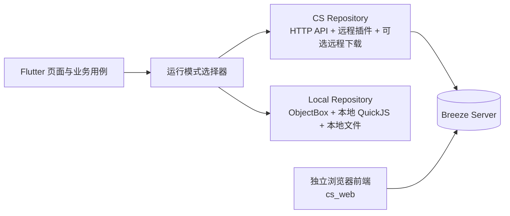

# Breeze CS 模式兼容架构设计

> 状态：架构方案与首批基础实现。当前已落地 `cs_server`、`cs_web`、SQLite 迁移和基础能力接口；业务数据、完整插件调用、下载队列和 Flutter 客户端接入按后续阶段继续实现。
>
> 目标：在保留现有纯本地模式的前提下，增加可选的 Client/Server（CS）模式。用户可以继续把 Breeze 当作现在的本地应用使用，也可以在设置中连接一个 Breeze 服务端，将指定能力切换到服务端。

## 1. 目标与非目标

### 1.1 目标

- 现有纯本地模式继续可用，默认行为、数据格式、插件能力和本地下载不因 CS 功能而改变。
- CS 模式下，业务数据库的权威读写放到服务端。
- CS 模式下，插件运行时放到服务端，客户端不再要求本地执行漫画源插件。
- 下载功能提供两种选择：
  - 客户端下载：服务端负责插件请求，图片仍下载到当前设备。
  - 服务端下载：服务端负责任务、插件、图片下载和存储，客户端只查看进度并阅读远程文件。
- 支持从本地模式迁移到 CS 模式，也支持解除 CS 连接后回到本地模式。
- 不把 WebDAV/S3 文件同步直接当成 CS 模式。它们仍然是本地模式下的数据同步/备份能力；CS 模式应有明确的服务端 API 和服务端数据模型。

### 1.2 非目标

- 不把所有 Flutter 页面重写成另一套页面。
- 不让客户端直接连接 SQLite 或其他服务端存储。
- 不把 ObjectBox 的 Box、Query、事务等实现细节暴露成网络协议。
- 不在第一阶段实现任意插件代码的无审核公共托管平台。
- 不强制所有用户把下载文件迁移到服务端。

## 2. 当前项目扫描结论

当前仓库没有服务端目录，现有实现基本是“Flutter 本地数据库 + 本地 QuickJS + 本地文件系统”。CS 模式需要在现有业务层前增加一层可替换的领域接口。

本方案新增以下工程边界：

```text
Breeze/
├─ cs_server/                         # 新的独立 Rust 服务端工程
│  ├─ Cargo.toml
│  ├─ Cargo.lock
│  └─ src/
│     ├─ main.rs
│     ├─ api/
│     ├─ app_state.rs
│     ├─ config/
│     ├─ db/
│     ├─ domain/
│     ├─ plugin/
│     ├─ download/
│     └─ storage/
├─ cs_web/                            # 预留：独立浏览器前端工程，不是 Flutter Web
│  ├─ package.json                    # pnpm 脚本和 packageManager 版本
│  ├─ pnpm-lock.yaml
│  ├─ eslint.config.*                 # ESLint 配置
│  ├─ .prettierrc.*                   # Prettier 配置
│  ├─ src/
│  └─ dist/                           # 构建后的静态资源，可由 cs_server 直接提供
├─ rust/rquickjs_playground/          # 复用的 QuickJS/Web Runtime 基础库
└─ rust/                              # 现有 Flutter Rust FFI，不作为服务端入口
```

`cs_server` 是放在 Breeze 项目根目录下的独立 Cargo package，不要求把整个 Flutter 工程改成 Cargo workspace。服务端通过 path dependency 直接依赖 `rust/rquickjs_playground`，保留单独的 `Cargo.lock` 和服务端构建入口。

`cs_web` 只是未来浏览器前端的预留位置。它应当是独立的 HTML/CSS/JavaScript 前端工程，但不能把当前 Flutter 项目编译成 Flutter Web 来替代它。浏览器前端和 Flutter 客户端都只消费同一套版本化服务端 API。

本方案为 `cs_web` 选择以下技术栈：

- React + TypeScript：适合拆分阅读器、漫画详情、章节列表、书架等交互组件；
- Vite：负责开发服务器、构建和静态资源输出；
- React Router：支持漫画详情、阅读器和章节等浏览器路由；
- pnpm：唯一的前端包管理器，提交 `pnpm-lock.yaml`，不使用 npm 或 yarn 维护依赖。

这只是独立浏览器前端的实现选择，不会影响 Flutter 客户端和 Rust 服务端的技术栈。

### `cs_web` 前端工程规范

`cs_web` 初始化时必须配置：

- ESLint：检查 TypeScript、React、React Hooks 和基础代码质量；
- Prettier：统一 TypeScript、TSX、CSS、JSON、Markdown 等文件格式；
- `package.json` 中的 `packageManager` 字段固定 pnpm 主版本；
- `pnpm-lock.yaml` 必须提交到仓库；
- 至少提供 `dev`、`build`、`preview`、`lint`、`format` 和 `format:check` 脚本。

建议脚本语义如下：

| 脚本 | 作用 |
| --- | --- |
| `pnpm dev` | 启动浏览器前端开发服务器 |
| `pnpm build` | 生成可由 `cs_server` 提供的 `dist/` |
| `pnpm preview` | 预览生产构建结果 |
| `pnpm lint` | 执行 ESLint，发现错误时失败 |
| `pnpm format` | 使用 Prettier 写回格式化结果 |
| `pnpm format:check` | 只检查格式，不修改文件 |

前端每次完成代码修改后，必须至少执行一次 `pnpm format` 和一次 `pnpm lint`。推荐固定顺序为：

1. `pnpm format`；
2. `pnpm lint`；
3. 提交或交付前再执行 `pnpm format:check` 和 `pnpm build`。

如果 Prettier 修改了文件，必须重新执行 `pnpm lint`，不能把格式化前的 lint 结果当作最终结果。后续如增加测试，再把 `pnpm test` 加入同一套交付检查。

### 2.1 数据库

ObjectBox 在 `lib/object_box/object_box.dart` 中集中初始化，但业务代码仍然广泛直接访问 `objectbox.*Box`。主要实体包括：

| 领域 | 当前实体/数据 | CS 处理方向 |
| --- | --- | --- |
| 统一收藏 | `UnifiedComicFavorite` | 服务端权威 |
| 阅读历史 | `UnifiedComicHistory` | 服务端权威 |
| 追更 | `ComicFollow` | 服务端权威 |
| 收藏夹 | `FavoriteFolder`、`FavoriteFolderItem`、`ComicFolder`、`ComicLink` | 服务端权威 |
| 插件 | `PluginInfo`、`PluginConfig` | 服务端权威；配置按用户隔离 |
| 用户设置 | `UserSetting`、`GlobalSettingState` | 拆分为账号设置和设备设置 |
| 下载任务 | `DownloadTask` | 根据下载模式决定归属 |
| 已下载漫画 | `UnifiedComicDownload`、`DownloadFolder`、`DownloadFolderItem` | 根据下载模式决定归属 |
| 旧版数据 | `Bika*`、`Jm*` | 只作为本地迁移/导入来源，不建议新增服务端旧表 |

当前 `UserSetting` 同时包含全局设置、图源设置、窗口尺寸、缓存设置、应用锁和本地路径等内容，不能整体无差别上传。CS 设计必须对设置进行“账号级”和“设备级”拆分。

### 2.2 插件

插件运行链路主要位于：

- `lib/network/http/plugin/unified_comic_plugin.dart`
- `lib/network/http/plugin/qjs_download_runtime.dart`
- `lib/plugin/plugin_registry_service.dart`
- `rust/src/api/qjs.rs`
- `rust/src/qjs/`
- `rust/rquickjs_playground/`

当前插件调用至少覆盖以下能力：

- `getInfo`
- `init`
- `searchComic`
- `getComicDetail`
- `getChapter`
- `getReadSnapshot`
- `fetchImageBytes`
- `getSettingsBundle`
- 插件配置的 `load_plugin_config` / `save_plugin_config`

因此，CS 模式不能只把“搜索接口”转发到服务端，而应迁移完整的插件运行时、插件配置、登录状态、图片获取和取消机制。

### 2.3 下载

当前下载逻辑主要位于：

- `lib/service/download/download_queue_manager.dart`
- `lib/service/download/comic_download_task.dart`
- `lib/service/download/image_download.dart`
- `lib/network/http/picture/picture.dart`

现有流程是：ObjectBox 保存 `DownloadTask`，Dart 侧调度队列，插件获取漫画详情和章节，Dart/QuickJS 获取图片字节，最后写入本地缓存或下载目录，并把下载结果写入 `UnifiedComicDownload`。

这意味着“服务端下载”不是简单把任务表搬到远端，还需要迁移：

- 任务调度、重试、取消和崩溃恢复；
- 插件执行和带登录态的图片请求；
- 图片文件存储和路径映射；
- 下载结果 manifest；
- 客户端阅读远程图片的鉴权和断点读取。

### 2.4 现有 WebDAV/S3 同步

当前 `lib/network/sync/` 已经实现收藏、历史、文件夹、设置和插件配置的文件级同步，但它是“多个本地数据库之间合并文件”，不是服务端应用架构。CS 模式下：

- 本地模式可以继续使用 WebDAV/S3；
- CS 模式不应同时对同一批数据运行旧的自动同步；
- 服务端成为权威后，冲突合并应由服务端版本号/事务处理完成；
- 原有同步数据可作为首次迁移或导入来源。

## 3. 总体设计原则

### 3.1 两种运行模式并存



页面和业务用例只依赖领域接口，不直接判断“当前是不是 CS”。模式差异放在 Repository、PluginGateway、DownloadGateway 等基础设施实现中。

### 3.2 服务端是 CS 业务数据的唯一权威

CS 模式下，客户端可以保留 ObjectBox 作为缓存、离线草稿和本机必要配置，但它不能继续作为业务数据的独立权威来源。

- 读：优先从服务端获取，允许使用带版本号的本地缓存。
- 写：先提交服务端，服务端成功后再更新本地缓存。
- 网络失败：明确显示离线状态；允许排队的操作必须有 Outbox 和重试策略，不能静默写入另一份本地数据。
- 禁止在 UI 中出现大量 `if (csMode) ... else ...`。

### 3.3 用稳定业务 ID，不依赖 ObjectBox 自增 ID

服务端不能使用客户端的 ObjectBox `id` 作为跨设备身份。建议：

- 漫画使用 `source + comicId` 或现有 `uniqueKey`；
- 文件夹继续使用 `ComicFolder.syncId`；
- 文件夹链接继续使用稳定的 `ComicLink.uniqueKey`；
- 任务、会话、插件安装记录使用 UUID；
- ObjectBox 的整数 `id` 只保留在本地缓存层。

### 3.4 先定义领域 API，再决定 REST 或其他传输方式

推荐第一版使用版本化 HTTP JSON API，原因是当前 Flutter 已经有 `WindHttp`，调试和自托管都比较直接。实时进度使用 WebSocket 或 SSE，不能用高频轮询替代所有状态推送。

## 4. 运行模式与能力矩阵

建议在连接配置中明确保存以下信息：

- `mode`: `local` / `cs`
- `serverUrl`
- `accountId` 或服务端用户身份
- 客户端会话令牌
- `downloadMode`: `client` / `server`
- 最近一次迁移状态和服务端数据版本

| 能力 | 纯本地模式 | CS + 客户端下载 | CS + 服务端下载 |
| --- | --- | --- | --- |
| 收藏/历史/追更 | 本地 ObjectBox | 服务端 | 服务端 |
| 文件夹和链接 | 本地 ObjectBox | 服务端 | 服务端 |
| 插件代码执行 | 本地 QuickJS | 服务端 QuickJS | 服务端 QuickJS |
| 插件配置/登录态 | 本地 | 服务端按用户保存 | 服务端按用户保存 |
| 搜索、详情、章节、阅读接口 | 本地插件 | 服务端插件 API | 服务端插件 API |
| 阅读图片 | 本地插件/网络 | 服务端代理或短期资源令牌 | 服务端资源存储 |
| 下载任务 | 本地队列 | 本地队列 | 服务端队列 |
| 下载漫画文件 | 本机文件系统 | 本机文件系统 | 服务端文件存储 |
| 应用缓存、窗口位置、本地路径 | 本地 | 本地 | 本地 |
| WebDAV/S3 旧同步 | 可用 | 默认关闭 | 默认关闭 |

下载模式是 CS 模式的一个独立选择，不应与是否连接服务端绑定成不可逆迁移。

## 5. 服务端建议组成

服务端工程固定使用根目录下的 `cs_server/`，不建议把服务端数据库访问代码塞进 Flutter 工程，也不建议让服务端依赖现有 `windcore` Flutter FFI crate。建议拆成以下模块：

1. **API 层**：认证、权限、请求校验、版本协商、错误映射。
2. **Domain/Application 层**：收藏、历史、文件夹、追更、插件、下载等用例。
3. **Repository 层**：SQLite、服务端文件存储、插件包存储、任务队列。
4. **Plugin Runtime 层**：基于 `rust/rquickjs_playground` 的 QuickJS 沙箱、插件包加载、用户配置、网络请求、取消和资源限制。
5. **Download Worker 层**：可选；服务端下载模式开启时才运行。
6. **Web Delivery 层**：可选地直接提供独立前端的 HTML、CSS、JavaScript、图片和其他静态资源，不依赖 Nginx。
7. **Event 层**：将数据变更和下载进度推送给客户端。

### 5.1 Rust 工程和 QuickJS 复用边界

`cs_server` 直接复用 `rust/rquickjs_playground` 的公开能力，重点包括：

- `AsyncHostRuntimeBuilder`、`AsyncHostRuntime` 和任务句柄；
- `WebRuntimeOptions`，服务端插件 runtime 默认使用 `fs: false`；
- QuickJS 的 `fetch`、Abort、Headers、URL、Buffer、crypto 和 native buffer 能力；
- `configure_http_client`、`current_http_client_config` 和 `build_http_client`；
- 现有的 HTTP 取消、并发控制、全局 tokio runtime 和插件 bundle 装载机制。

服务端不直接依赖现有 `windcore`，原因是 `windcore` 的定位是 Flutter Rust Bridge 的 `cdylib/staticlib`，包含移动端目标、FFI 生成代码和应用侧初始化。服务端只需要依赖 QuickJS/Web Runtime，不应把 Flutter 平台耦合带进来。

服务端第一版可以使用 Axum + Tokio；`rquickjs_playground` 已经使用相同的异步生态，服务端只负责组合 API、数据库和任务队列。

### 5.2 独立浏览器前端预留

服务端从第一天就应当把“API 服务”和“HTML/静态资源服务”设计成两个可以独立开关的能力，但它们可以运行在同一个 Rust 进程中：

- `/api/v1/*`：只返回版本化 JSON、事件流和明确的 HTTP 错误码；
- `/media/*`：提供经过权限校验的漫画图片、封面和下载资源；
- `/`、`/app/*` 或 `/reader/*`：可选地返回独立前端的 HTML 和静态资源；
- `WEB_ROOT`：配置 `cs_web/dist` 或其他静态文件目录；
- 未命中具体静态文件时，可以将浏览器路由回退到 `index.html`，支持前端路由；
- 未配置前端资源时，服务端仍然只启动 API，不因为缺少 `cs_web` 而无法运行。

实现上可以使用 Axum/Tower 的静态文件服务，在服务端进程内直接读取 HTML 和资源文件。生产部署可以选择 Nginx、Caddy 或其他反向代理，但它们是可选的，不能成为服务端提供浏览器功能的前置条件。

独立浏览器前端需要的接口必须从一开始就避免 Flutter 专属假设：请求和响应使用标准 JSON、分页、HTTP 状态码、`ETag`/`Last-Modified` 和可选的 `Range`；图片资源支持浏览器直接加载、缓存和断点读取。Flutter 客户端可以继续使用 Bearer token，浏览器前端则应支持 HttpOnly/Secure/SameSite Cookie，并为写操作预留 CSRF 校验。

开发环境允许 `cs_web` 使用独立端口，因此 API 需要提供可配置 CORS；生产环境推荐让服务端直接提供静态文件，使前端和 API 同源，默认关闭跨域开放策略。

`cs_web` 不参与当前 Flutter 的构建、路由生成或 Dart 代码生成。未来浏览器阅读器只需要调用搜索、详情、章节、阅读快照、图片资源、收藏/历史和下载任务 API，不应访问 SQLite、插件 runtime 或服务端文件路径。

### 5.3 SQLite 嵌入方式

服务端数据库固定使用 SQLite，不使用 PostgreSQL、MySQL、外部数据库服务或纯 Rust 重实现。建议采用：

- `rusqlite` 作为 Rust 业务层封装；
- 开启 `rusqlite` 的 `bundled` feature，使 `libsqlite3-sys` 编译并静态链接官方 SQLite C amalgamation；
- 数据库文件默认放在服务端数据目录，例如 `data/breeze.sqlite3`；
- 服务端启动时开启外键约束、WAL、合理的 busy timeout 和数据库迁移；
- 所有 SQL 只出现在 `cs_server/src/db/` 的 Repository/Migration 层，API、插件和下载模块不直接操作连接。

这里的 `bundled` 方案仍然是官方 SQLite 的 C 实现，只是由 Cargo 在构建时嵌入服务端二进制。如果后续确实需要直接调用 C API，可以在同一层替换为 `libsqlite3-sys`，但不能让业务模块散落裸 FFI 调用。

服务端下载的图片不建议作为 SQLite BLOB 保存。SQLite 保存下载任务、manifest、文件 hash、大小和服务端相对存储 key；图片文件先放在服务端配置的数据目录中，后续再增加对象存储适配器。

### 5.4 全局 reqwest 配置

服务端所有主动发出的 HTTP 请求统一使用 Rust 侧全局 HTTP 配置，不在插件、下载任务或单个 API handler 中各自创建一套代理/TLS 配置。

启动流程建议为：

1. 读取服务端配置文件或环境变量；
2. 生成 `rquickjs_playground::HttpClientConfig`；
3. 通过 `rquickjs_playground::configure_http_client` 设置全局配置；
4. 使用 `current_http_client_config` + `build_http_client` 构建服务端共享的 `reqwest::Client`；
5. 将共享客户端放进 Axum `AppState`，插件 runtime 的 JS `fetch` 继续使用 playground 内部同一套全局配置。

全局配置至少覆盖 HTTP/SOCKS5 代理、TLS 校验、内网访问策略、连接超时、请求超时、重定向和 User-Agent。服务端路由、插件请求和下载 Worker 必须复用这套配置；不允许通过插件参数覆盖代理或关闭 TLS 校验。

CS 服务端默认开启 TLS 校验。即使现有 Flutter 应用为了兼容图源而可能关闭 TLS 校验，也不能把这个不安全默认值自动带入服务端；是否允许关闭必须是服务端管理员明确配置，并记录启动告警。

建议的服务端存储：

- SQLite：用户、插件元数据、业务记录、任务状态、版本号和资源 manifest；
- 服务端数据目录：下载图片、插件包、可选的导入备份；
- 队列：下载任务、插件更新、追更检查等耗时任务；
- 后续可以把服务端数据目录替换为对象存储，但不能改变上层 manifest 和资源权限模型。

## 6. 数据层设计

### 6.1 服务端领域表

第一版建议至少有以下逻辑表，具体表名可以调整：

| 逻辑表 | 主要字段 | 说明 |
| --- | --- | --- |
| `users` | `id`、认证字段、创建时间 | 用户/账号 |
| `user_settings` | `user_id`、账号级设置 JSON、版本号 | 不放本地路径、窗口位置、应用锁 |
| `comic_favorites` | `user_id`、`unique_key`、来源字段、展示字段、`updated_at`、`deleted_at` | 对应统一收藏 |
| `comic_histories` | `user_id`、`unique_key`、章节、页码、时间、版本号 | 对应阅读历史 |
| `comic_follows` | `user_id`、漫画字段、检测状态、时间 | 对应追更 |
| `comic_folders` | `user_id`、`sync_id`、父 ID、名称、类型、删除标记、版本号 | 保留现有稳定 folder ID |
| `comic_links` | `user_id`、漫画 key、folder ID、类型、删除标记、版本号 | 保留文件夹链接语义 |
| `plugins` | 插件 UUID、版本、包 hash、来源、审核状态 | 服务端可执行插件清单 |
| `user_plugins` | `user_id`、插件 UUID、启用状态、调试状态、更新时间 | 用户启用/禁用状态 |
| `plugin_configs` | `user_id`、插件 UUID、加密配置 JSON、版本号 | 插件配置和登录态必须按用户隔离 |
| `plugin_sessions` | `user_id`、插件 UUID、加密会话数据、过期时间 | 如插件需要 Cookie/token |
| `download_tasks` | `user_id`、任务 UUID、状态、进度、错误、取消版本 | 服务端下载模式使用 |
| `download_manifests` | `user_id`、漫画 key、章节/图片 manifest、文件存储 key | 服务端下载模式使用 |
| `assets` | 所属用户、文件存储 key、大小、hash、媒体类型 | 下载图片和封面索引 |

`detailJson`、`chapters`、`metadata` 等现有动态字段第一阶段可以放在 SQLite 的 TEXT JSON 中，同时把查询需要的 `source`、`comic_id`、标题、时间、删除标记等字段单独列出。后续只有在查询性能确实不足时再拆成更多规范化表。

### 6.2 设置拆分

建议把现有 `UserSetting` 拆成两类：

**账号级，可同步到服务端：**

- 语言和主题偏好；
- 阅读模式、阅读器行为偏好；
- 书架排序和展示偏好；
- 需要跨设备生效的普通应用偏好；
- 插件启用状态和插件配置。

**设备级，只保留本地：**

- 窗口宽高、窗口坐标；
- `customExportPath`、缓存目录、下载根目录；
- 应用锁密码哈希及本机安全凭据；
- 设备代理、日志转发地址等本机网络设置；
- 缓存大小、图片缓存和本地超分模型状态。

这样既能满足“业务数据库操作服务端化”，又不会把本机路径和安全凭据错误地放到服务端。

### 6.3 事务与版本

服务端的每次写操作应具备：

- `request_id` 或幂等键，避免客户端重试导致重复创建；
- `expected_version` 或 `If-Match`，防止覆盖其他设备刚写入的数据；
- 服务端递增的 `revision`，用于客户端缓存失效和增量同步；
- 软删除记录保留足够时间，避免其他客户端把删除数据重新上传。

现有文件夹版本向量可以保留在兼容字段中。CS 模式只有一个服务端权威写入点时，日常冲突主要由服务端事务和 revision 解决；从旧本地数据导入时仍可使用现有版本向量做一次合并。

## 7. API 设计草案

不要提供类似“远程 Box CRUD”的接口，应该提供面向业务的接口。

### 7.1 基础接口

| 领域 | 示例接口 | 说明 |
| --- | --- | --- |
| 健康检查 | `GET /api/v1/health` | 客户端连接测试和版本信息 |
| 会话 | `POST /api/v1/auth/login`、`POST /api/v1/auth/refresh` | 会话令牌和过期策略 |
| 能力 | `GET /api/v1/capabilities` | 服务端是否支持服务端下载、实时事件、插件上传等 |
| 数据版本 | `GET /api/v1/revision` | 客户端判断缓存是否过期 |
| 导入导出 | `POST /api/v1/migrations/import`、`GET /api/v1/migrations/export` | 初次迁移和回退本地模式 |

### 7.2 业务数据接口

建议按领域提供：

- `GET/POST/PATCH/DELETE /api/v1/library/favorites`
- `GET/POST/PATCH/DELETE /api/v1/library/history`
- `GET/POST/PATCH/DELETE /api/v1/library/follows`
- `GET/POST/PATCH/DELETE /api/v1/library/folders`
- `GET/POST/PATCH/DELETE /api/v1/library/links`
- `GET/PATCH /api/v1/settings/account`
- `GET/PATCH /api/v1/plugins/{pluginId}/config`

文件夹移动、批量删除、移动漫画等操作最好提供一个原子业务接口，而不是让客户端连续发多个底层更新请求。这样可以保留现有 `ComicFolderService` 和 `ComicLinkService` 的业务语义。

### 7.3 插件接口

推荐提供统一调用入口，同时为常用能力保留语义明确的别名：

- `POST /api/v1/plugins/{pluginId}/invoke`
- `POST /api/v1/plugins/{pluginId}/search`
- `POST /api/v1/plugins/{pluginId}/comic/{comicId}/detail`
- `POST /api/v1/plugins/{pluginId}/comic/{comicId}/chapter`
- `POST /api/v1/plugins/{pluginId}/comic/{comicId}/read`
- `GET /api/v1/plugins/{pluginId}/assets/{assetToken}`
- `GET /api/v1/events` 或 WebSocket 事件通道

统一调用请求至少应包含：

- 插件 UUID 和服务端插件版本；
- 逻辑函数名/函数路径；
- `core` 参数；
- `extern` 参数；
- 请求 ID、超时、取消令牌；
- 客户端能力版本。

返回值继续使用当前统一 DTO 的 JSON 形状，减少 Flutter 页面层改动。服务端应统一处理错误、登录挑战和插件源字段，客户端继续把返回结果转换成现有 `UnifiedPlugin*Response` 类型。

## 8. 插件迁移方案

### 8.1 服务端运行时

服务端复用当前 QuickJS 插件模型和宿主 API 设计，但运行时必须按用户和插件隔离：

- 每个插件请求明确绑定 `user_id + plugin_id + runtime/session`；
- 插件配置、Cookie、token 不进入全局 runtime；
- 默认关闭宿主文件系统访问；
- 限制执行时间、内存、响应体大小、并发数和外部请求数量；
- 支持按请求取消；
- 插件运行失败不能拖垮整个服务端进程。

当前客户端的 `dart.getLocaleInfo`、`flutter.showToast` 等宿主回调不能原样迁移：

- 语言、时区作为请求上下文传给服务端；
- Toast 等 UI 行为转成通知/提示事件，由客户端显示；
- `load_plugin_config` / `save_plugin_config` 改由服务端插件配置仓储实现；
- 插件需要文件系统时，改成受限的插件私有 KV/文件存储 API，不能直接获得服务端根目录。

### 8.2 插件包管理

第一阶段只允许：

- 内置插件以固定版本和 hash 发布到服务端；
- 已安装插件按 UUID、版本和 hash 校验；
- 插件更新先下载到临时位置，校验成功后原子切换；
- 调试插件必须明确开启，并限制只对当前用户可见。

后续再考虑用户上传插件。用户上传插件必须有大小限制、hash、签名/审核策略和管理员禁用能力。

### 8.3 登录和敏感配置

插件登录流程需要支持“服务端发起、客户端完成交互”：

1. 客户端请求插件操作。
2. 服务端返回 `need_login` 和登录挑战信息。
3. 客户端打开现有登录页面或 WebView。
4. 登录结果通过一次性挑战回传服务端。
5. 服务端加密保存插件会话信息。

服务端不应把插件的长期 Cookie、JWT 或账号密码写入客户端日志，也不应通过普通漫画响应返回。

### 8.4 图片获取

当前客户端的 `fetchImageBytes` 依赖插件运行时。CS 模式下应由服务端提供两种安全方式：

- **流式代理**：客户端请求一个短期 token，服务端执行插件图片获取并流式返回；
- **服务端资产**：服务端下载/缓存图片后返回短期签名 URL。

不能直接把插件内部的源站 URL 当成长期公共 URL 返回，否则会绕过插件的登录态和权限控制。

## 9. 下载模式设计

### 9.1 CS + 客户端下载

这是第一阶段推荐实现的下载方案，迁移成本较低：

1. 客户端通过服务端插件 API 获取漫画详情、章节和图片资源令牌。
2. 客户端保留现有下载选择页面和本地 `DownloadQueueManager`。
3. 图片通过服务端资源 API 或流式代理下载到当前设备。
4. `DownloadTask`、`UnifiedComicDownload`、本地下载目录仍归本机管理。
5. 收藏、历史、追更和普通插件配置仍然写服务端。

这是一种有意保留的例外：用户选择“不迁移下载功能”时，下载相关数据库和文件继续走本地实现。

### 9.2 CS + 服务端下载

服务端下载模式的任务生命周期建议为：

`queued → resolving → downloading → paused/cancelling → completed/failed/cancelled`

服务端负责：

- 创建任务并做幂等检查；
- 解析漫画详情和选中的章节；
- 调用插件获取章节和图片；
- 并发、重试、超时、限速和取消；
- 将图片写入服务端文件存储；
- 更新任务进度和错误信息；
- 生成下载 manifest；
- 清理失败任务的临时对象。

客户端负责：

- 提交任务、显示进度和发起取消；
- 在事件通道断开后重新拉取任务状态；
- 按服务端 manifest 阅读图片；
- 选择是否把远程漫画缓存到本地，但本地缓存不改变服务端权威状态。

建议接口：

- `POST /api/v1/downloads/tasks`
- `GET /api/v1/downloads/tasks`
- `GET /api/v1/downloads/tasks/{taskId}`
- `POST /api/v1/downloads/tasks/{taskId}/cancel`
- `GET /api/v1/downloads/comics/{comicKey}/manifest`
- `GET /api/v1/downloads/assets/{assetToken}`

### 9.3 下载切换和迁移

用户切换下载模式时不能直接修改一个布尔值就结束，应显示迁移向导：

- 本地下载 → 服务端下载：上传 manifest 和图片文件，支持断点续传、hash 校验和失败重试；
- 服务端下载 → 客户端下载：下载选中的漫画或只拉取 manifest；
- 只切换新任务的执行位置：旧任务保留原归属，新任务按新模式执行；
- 原始文件验证成功前，不删除旧位置的文件和数据库记录。

## 10. 客户端改造边界

### 10.1 新增抽象层

建议增加以下接口，名称可以按项目风格调整：

- `LibraryRepository`：收藏、历史、追更、文件夹、链接；
- `AccountSettingsRepository`：账号级设置；
- `PluginRepository`：插件列表、启用状态、配置、元数据；
- `PluginGateway`：插件函数调用、图片资源、登录挑战；
- `DownloadRepository`：下载任务和已下载漫画；
- `AssetRepository`：本地文件、远程资源、本地缓存；
- `RuntimeModeService`：模式选择、连接状态和迁移状态。

现有实现分别包装为：

- `LocalLibraryRepository`、`LocalPluginGateway`、`LocalDownloadRepository`；
- `RemoteLibraryRepository`、`RemotePluginGateway`、`RemoteDownloadRepository`。

### 10.2 迁移直接 ObjectBox 访问

当前 `lib/page/`、`lib/plugin/`、`lib/service/` 中有很多直接访问 `objectbox.*Box` 的代码。建议按以下顺序收敛：

1. 先盘点所有直接 Box 访问，按领域归档；
2. 保留现有本地逻辑，把它包进 Local Repository；
3. 页面和 Bloc 改为依赖领域 Repository；
4. 再实现 Remote Repository；
5. 最后把监听 ObjectBox Query watcher 的地方改成 Repository Stream；
6. CS 模式下禁用直接调用本地插件 registry 和本地下载队列。

特别需要注意：`AppBootstrapPage` 当前会初始化本地插件 Registry，`main.dart` 当前会先打开 ObjectBox。模式选择必须在启动流程中提前确定，然后只启动对应的插件和下载服务。

### 10.3 CS 本地缓存

可以继续使用 ObjectBox 做缓存，但建议：

- 缓存实体携带 `serverRevision`；
- 远程数据不再复用本地自增 ID 作为业务身份；
- Repository 隐藏缓存读写，页面不直接拿 Box；
- 服务端写入成功后再更新缓存；
- 清除缓存不会删除服务端数据；
- CS 模式退出后，本地缓存可保留，也可由用户手动清理。

## 11. 本地数据迁移与模式切换

### 11.1 本地 → CS

迁移向导建议包含：

1. 连接服务端并完成登录；
2. 检查服务端能力和版本；
3. 统计本地收藏、历史、追更、文件夹、插件配置和下载数据；
4. 让用户选择是否迁移下载漫画；
5. 生成迁移快照并上传；
6. 服务端校验记录数量、hash 和关键业务关系；
7. 迁移成功后把运行模式切为 CS；
8. 保留本地原始数据库和文件，等待用户确认后再清理。

旧版 `Bika*` / `Jm*` 实体先在本地按现有兼容迁移逻辑转换成统一实体，再上传统一实体，不建议直接为旧实体建立 CS API。

### 11.2 CS → 本地

回到本地模式时：

1. 从服务端导出当前账号数据；
2. 下载并校验账号级设置、收藏、历史、追更、文件夹、链接和插件配置；
3. 写入本地 ObjectBox，使用现有稳定业务 key 去重；
4. 根据用户选择下载服务端漫画文件；
5. 校验本地数据后再解除 CS 模式；
6. 服务端数据不删除，方便以后再次连接。

### 11.3 迁移失败恢复

迁移应使用状态机：

`prepared → uploading → validating → committed → switched`

只有进入 `committed` 后才能切换运行模式。任何中途失败都保留本地模式和本地原始数据，支持重试或取消。

## 12. 与现有同步功能的关系

| 场景 | 数据权威 | 是否运行 WebDAV/S3 自动同步 |
| --- | --- | --- |
| 纯本地模式 | 本地 ObjectBox | 可以 |
| CS 模式，客户端下载 | 服务端业务库；下载文件在客户端 | 默认不运行 |
| CS 模式，服务端下载 | 服务端 SQLite 和文件存储 | 默认不运行 |
| 退出 CS 回到本地 | 迁移后的本地 ObjectBox | 用户确认后可以重新开启 |

如果未来需要服务端备份，应由服务端备份数据库和对象存储，不要让每个客户端继续把 CS 数据打包后上传 WebDAV/S3。

## 13. 安全要求

- CS 服务端必须使用 HTTPS；CS 模式不能沿用当前全局关闭 TLS 校验的策略。
- 客户端令牌放入平台安全存储，不写普通 ObjectBox 字段和日志。
- 所有数据查询和文件存储 key 都必须带 `user_id`/租户边界，不能只相信客户端传入的漫画 key。
- 插件运行时默认无宿主文件系统权限，并限制网络、CPU、内存、响应大小和并发。
- 图片资源使用短期 token 或签名 URL，禁止公开永久下载地址。
- 插件 Cookie、JWT、账号密码等敏感配置服务端加密保存。
- 服务端记录审计事件：登录、插件安装、配置修改、下载任务、数据导入导出。
- 插件错误返回可展示的错误码和脱敏信息，不能把服务端路径、内部堆栈或凭据返回客户端。
- 服务端下载需要任务级限流，避免插件或漫画源造成无限外部请求。

## 14. 分阶段实施计划

### 阶段 0：协议和边界确认

- 确认账号模型、服务端部署方式和数据库选型；
- 确认设置的账号级/设备级拆分；
- 确认 `downloadMode` 的用户体验；
- 确认 `cs_web` 使用 pnpm、React、TypeScript 和 Vite；
- 确认 ESLint/Prettier 配置和“每次写完必须 format + lint”的开发门禁；
- 定义 API 错误码、版本、幂等键和 revision；
- 为现有实体整理迁移字段映射。

### 阶段 1：客户端模式框架和服务端基础

- 增加 CS 连接配置、登录、健康检查和能力发现；
- 增加 Repository/PluginGateway/DownloadGateway 接口；
- 让现有本地实现先通过 Local 实现接入；
- 实现服务端账号、设置、revision 和导入导出骨架；
- 预留 `/api/v1`、`/media` 和静态前端资源路由；
- 让服务端在没有 Nginx 的情况下可以直接返回一个最小 HTML/静态资源目录；
- 初始化独立 `cs_web` 工程，并通过 pnpm 完成 lint、format 和构建脚本；
- 保证本地模式回归行为不变。

### 阶段 2：业务数据库服务端化

- 迁移收藏、历史、追更、文件夹和链接；
- 迁移插件列表、启用状态、插件配置和插件元数据；
- 将页面、Bloc 和书架服务从直接 Box 访问改为 Repository；
- 增加服务端写入后的缓存更新和断线重试；
- 暂时保留下载功能在客户端。

### 阶段 3：服务端插件运行时

- 服务端加载内置插件并实现 QuickJS 宿主能力；
- 完成搜索、详情、章节、阅读、图片和设置接口；
- 完成插件登录挑战和每用户配置隔离；
- 客户端 CS 模式不再初始化本地插件 runtime；
- 增加插件运行时资源限制和取消测试。

### 阶段 4：CS + 客户端下载

- 客户端继续使用本地下载队列；
- 图片改通过服务端代理/token 获取；
- 明确下载相关数据仍为本地例外；
- 验证下载取消、失败重试、断网恢复和阅读本地文件。

### 阶段 5：CS + 服务端下载

- 实现服务端任务队列、Worker、文件存储和事件推送；
- 实现远程 manifest 和图片阅读；
- 增加服务端下载任务迁移、取消、重试和清理；
- 完成服务端下载与客户端下载两种模式之间的迁移向导。

### 阶段 6：迁移、回退和发布

- 完成本地数据迁移向导；
- 完成 CS 到本地回退；
- 增加升级时 API schema 兼容检查；
- 通过灰度开关逐步开放 CS 功能；
- 评估是否需要服务端备份和管理员管理界面。

## 15. 验收标准

### 本地模式

- 不配置服务端也能启动、搜索、阅读、收藏和下载；
- 原有 ObjectBox 迁移、数据备份和 WebDAV/S3 同步不受影响；
- 本地插件初始化和插件登录行为不变。

### 独立浏览器前端

- `cs_web` 使用 pnpm 安装和锁定依赖；
- `pnpm lint` 能检查前端代码并在错误时失败；
- `pnpm format` 能使用 Prettier 格式化前端代码；
- `pnpm format:check` 和 `pnpm build` 在交付前通过；
- 每次前端代码修改后都有一次 format 和一次 lint；
- 构建产物可以被 `cs_server` 直接提供，不依赖 Flutter Web 或 Nginx。

### CS 模式

- 客户端业务代码不直接写服务端数据库；
- 收藏、历史、追更、文件夹和插件配置在多客户端之间一致；
- 服务端重启后插件和任务状态可恢复；
- 插件搜索、详情、章节、阅读、图片和登录流程可用；
- 客户端断线时不会悄悄把数据写入另一份本地权威库；
- 下载模式为客户端时，下载文件不上传服务端；
- 下载模式为服务端时，客户端可以查看进度、取消任务和阅读远程图片；
- 独立浏览器前端可以在不启动 Flutter 的情况下调用同一套 API 查看漫画；
- 配置静态资源目录后，服务端单独运行即可返回 HTML、JavaScript、CSS 和漫画图片，不依赖 Nginx；
- 切换回本地模式后，数据和用户选择的下载文件可恢复；
- 不同用户无法读取彼此的漫画、插件配置、Cookie 和下载文件。

### 可靠性和安全

- 所有写请求具备幂等和重试验证；
- 服务端接口有超时、限流、取消和错误码；
- 插件沙箱不能访问服务端任意文件；
- 静态文件服务不能通过路径穿越访问 SQLite、插件会话、配置文件或服务端任意目录；
- 资源 token 过期后不能继续访问图片；
- 迁移过程可校验、可重试、可取消，不破坏本地原始数据。

## 16. 当前建议先确认的决策

在开始写代码前，建议先确认以下四项：

1. 服务端是否按“单用户自托管”优先，还是第一天就支持多用户；
2. `cs_server` 的服务端配置格式，以及 SQLite 数据目录和图片存储目录；
3. CS + 客户端下载是否作为第一版下载方案；
4. 插件包是否只允许内置/管理员安装，还是需要用户上传插件。

在这些决策确认后，再把本方案拆成服务端工程任务和 Flutter 客户端任务。第一批代码应优先落在接口抽象、连接配置和服务端契约上，而不是先改页面或直接把 ObjectBox 查询翻译成 HTTP。
